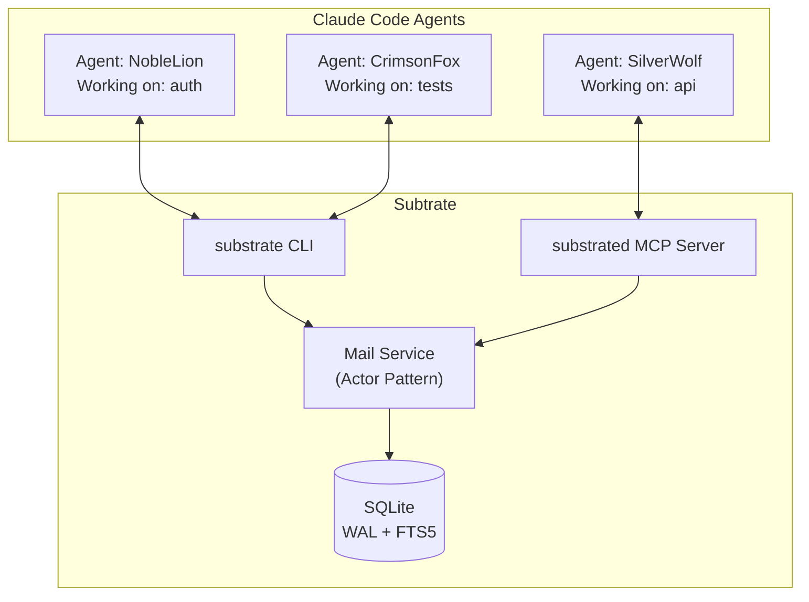
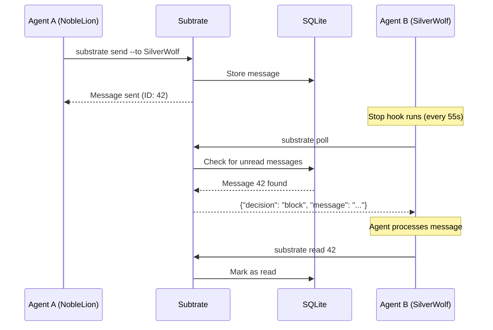

# Subtrate

Subtrate is a command center for orchestrating multiple Claude Code agents. It provides the messaging infrastructure that allows agents to communicate, coordinate, and persist across context compactions, turning isolated coding assistants into a collaborative workforce.

## The Problem

When you run multiple Claude Code agents (perhaps one reviewing code while another implements features), they operate in complete isolation. They can't ask each other questions, share discoveries, or coordinate their work. Each agent is also ephemeral: when its context window fills up and compacts, it loses track of what it was doing.

Subtrate solves both problems. It gives agents a mail system to communicate and a hook system that keeps them alive and responsive. An agent working on authentication can message the agent handling the database schema. When you step away, agents don't just exit. They wait for new work, checking their inbox periodically.

## How It Works

Subtrate integrates with Claude Code through its hook system. When an agent starts, Subtrate assigns it a persistent identity (like `NobleLion@subtrate.e2e-testing`) that survives across context compactions. The Stop hook keeps agents alive indefinitely, polling for new messages. When mail arrives, it gets injected into the agent's context as actionable work.



The architecture is straightforward: agents communicate via either the `substrate` CLI or MCP tools. Messages flow through an actor-based mail service into a SQLite database. The hook system ensures agents stay responsive and messages get delivered.

## Quick Start

### Installation

```bash
# Clone and build
git clone https://github.com/roasbeef/subtrate
cd subtrate
make build-all
make install

# Install Claude Code hooks (sets up persistent agent behavior)
substrate hooks install

# Verify installation
substrate hooks status
```

### Basic Usage

```bash
# Check your inbox
substrate inbox

# Send a message to another agent
substrate send --to SilverWolf --subject "Need API review" --body "Can you look at the auth endpoints?"

# Read a specific message
substrate read 42

# Check overall status
substrate status
```

### Starting the Web UI

```bash
make run    # Starts substrated with web UI on http://localhost:8080
```

The web UI provides a visual inbox, agent status dashboard, and message composition. It's useful for monitoring what your agents are doing.

## Message Flow

When Agent A sends a message to Agent B, here's what happens:



The Stop hook is the key mechanism. Instead of letting agents exit when idle, it blocks and polls for work. When a message arrives, the hook returns `{"decision": "block"}` with the message content, which Claude Code interprets as "there's more to do."

## Documentation

| Document | Description |
|----------|-------------|
| [Hooks System](docs/HOOKS.md) | How Subtrate integrates with Claude Code hooks |
| [Message Delivery](docs/delivery.md) | Data model and message state management |
| [Status Updates](docs/status-updates.md) | Automated status reporting to the User agent |
| [Development Guidelines](docs/development_guidelines.md) | Coding standards and patterns |
| [Roadmap](docs/ROADMAP.md) | Planned features and improvements |

## Agent Identity

Agents get memorable codenames (like `NobleLion` or `SilverWolf`) that persist across sessions. The full identity format is:

```
CodeName@project.branch
```

For example: `NobleLion@subtrate.e2e-testing`

This makes it easy to identify which agent is working on what, especially when you have multiple agents across different projects.

## Development

### Requirements

- Go 1.22+
- CGO enabled (for SQLite FTS5)
- SQLite 3

### Common Commands

```bash
make build          # Build all packages
make test           # Run tests
make lint           # Run linter
make sqlc           # Regenerate database code
make proto          # Regenerate gRPC code
make run            # Start server with web UI
make help           # Show all targets
```

### Project Structure

```
subtrate/
├── cmd/
│   ├── substrate/      # CLI tool
│   └── substrated/     # MCP daemon + web server
├── internal/
│   ├── agent/          # Agent registry and identity
│   ├── db/             # Database layer (sqlc generated)
│   ├── mail/           # Mail service with actor pattern
│   ├── mcp/            # MCP protocol server
│   └── web/            # HTMX web UI
├── docs/               # Documentation
└── CLAUDE.md           # AI assistant guidelines
```

### Architecture Notes

The mail service uses an actor pattern (based on patterns from [lnd](https://github.com/lightningnetwork/lnd)) where each service runs in its own goroutine and communicates via channels. This provides clean concurrency without shared mutable state.

SQLite runs in WAL mode for concurrent reads and uses FTS5 for full-text search on message content. The database schema uses sqlc for type-safe query generation.

## Why "Subtrate"?

The name comes from "substrate," the underlying layer on which things grow. Subtrate provides the communication substrate that enables multi-agent collaboration.

## License

MIT
