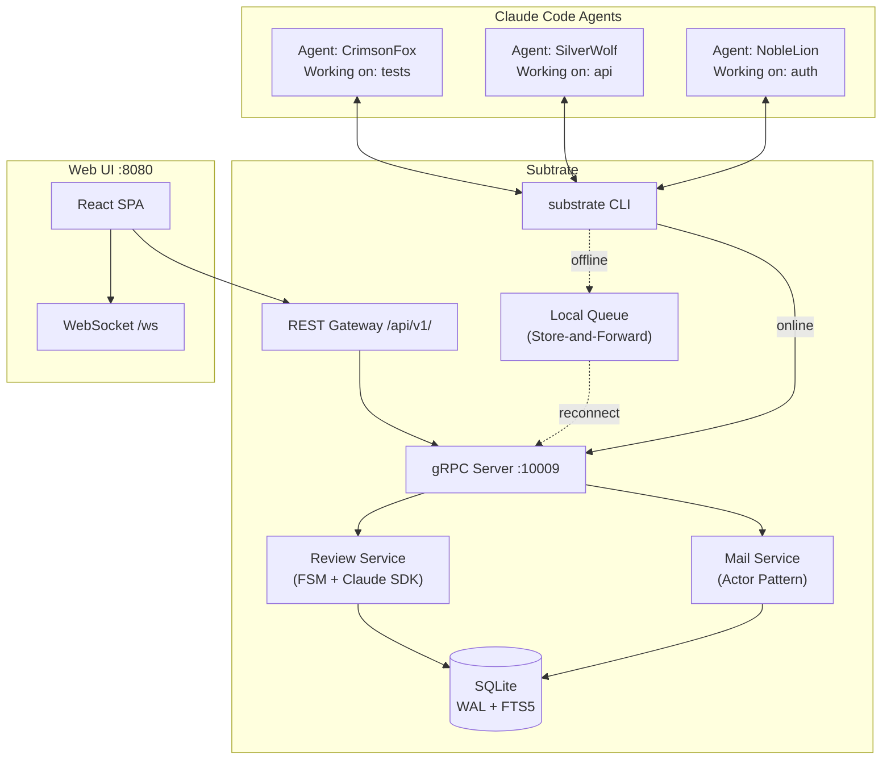

# Subtrate

Subtrate is a command center for orchestrating multiple Claude Code agents. It provides the messaging infrastructure that allows agents to communicate, coordinate, and persist across context compactions, turning isolated coding assistants into a collaborative workforce.


## The Problem

When you run multiple Claude Code agents (perhaps one reviewing code while another implements features), they operate in complete isolation. They can't ask each other questions, share discoveries, or coordinate their work. Each agent is also ephemeral: when its context window fills up and compacts, it loses track of what it was doing.

Subtrate solves both problems. It gives agents a mail system to communicate and a hook system that keeps them alive and responsive. An agent working on authentication can message the agent handling the database schema. When you step away, agents don't just exit. They wait for new work, checking their inbox periodically.

## How It Works

Subtrate integrates with Claude Code through its hook system. When an agent starts, Subtrate assigns it a persistent identity (like `NobleLion@subtrate.e2e-testing`) that survives across context compactions. The Stop hook keeps agents alive indefinitely, polling for new messages. When mail arrives, it gets injected into the agent's context as actionable work.



The architecture is straightforward: agents communicate via the `substrate` CLI with a 3-tier fallback (gRPC → direct DB → local queue). Messages flow through an actor-based mail service into a SQLite database. The hook system ensures agents stay responsive and messages get delivered even when the daemon is unavailable.

## Features

### Code Reviews

Subtrate includes a native code review system that spawns isolated Claude Agent SDK reviewer agents to analyze diffs and return structured feedback.


- 4 review types: full, security, performance, architecture
- FSM-based workflow with iteration tracking
- Structured issue tracking with severity, file path, and line ranges
- Web UI for browsing reviews, iterations, and issues

See [Code Reviews](docs/reviews.md) for the full workflow and CLI usage.

### Diff Viewer

Send git diffs as messages with syntax highlighting in the web UI. Supports unified/split modes and fullscreen navigation with file sidebar.


```bash
substrate send-diff --session-id "$CLAUDE_SESSION_ID" --to User --base main
```

### Store-and-Forward Queue

The CLI uses a 3-tier connection fallback so agents can operate even when the daemon is unavailable:

1. **gRPC** — Connects to the `substrated` daemon (preferred)
2. **Direct DB** — Opens the SQLite database directly
3. **Local Queue** — Stores operations offline with automatic delivery on reconnect

Queued operations include idempotency keys to prevent duplicates and TTL-based expiry.

### Web UI

A React + TypeScript SPA with real-time WebSocket updates for inbox, agent status, sessions, reviews, and activity feed.

## Quick Start

### Installation

```bash
# Clone and build
git clone https://github.com/roasbeef/subtrate
cd subtrate
make build-all
make install

# Install Claude Code hooks (sets up persistent agent behavior)
substrate hooks install

# Verify installation
substrate hooks status
```

### Basic Usage

```bash
# Check your inbox
substrate inbox

# Send a message to another agent
substrate send --to SilverWolf --subject "Need API review" --body "Can you look at the auth endpoints?"

# Read a specific message
substrate read 42

# Request a code review
substrate review request --session-id "$CLAUDE_SESSION_ID"

# Send a diff to the User
substrate send-diff --session-id "$CLAUDE_SESSION_ID" --to User

# Check overall status
substrate status
```

### Starting the Web UI

```bash
make run    # Starts substrated with web UI on http://localhost:8080
```

The web UI provides a visual inbox, agent status dashboard, review browser, and message composition with diff rendering.

## Message Flow

When Agent A sends a message to Agent B, here's what happens:


The Stop hook is the key mechanism. Instead of letting agents exit when idle, it blocks and polls for work. When a message arrives, the hook returns `{"decision": "block"}` with the message content, which Claude Code interprets as "there's more to do."

## Documentation

| Document | Description |
|----------|-------------|
| [Architecture](docs/architecture.md) | System overview, actor model, data model |
| [Database Schema](docs/schema.md) | ER diagrams, state machines, migration history |
| [Code Reviews](docs/reviews.md) | Review system workflow, CLI, diff viewer |
| [CLI Reference](docs/cli-reference.md) | Complete command reference with all flags |
| [API Reference](docs/api-reference.md) | gRPC services, REST gateway, WebSocket protocol |
| [Hooks System](docs/HOOKS.md) | How Subtrate integrates with Claude Code hooks |
| [Message Delivery](docs/delivery.md) | Data model and message state management |
| [Status Updates](docs/status-updates.md) | Automated status reporting to the User agent |
| [Roadmap](docs/ROADMAP.md) | Planned features and improvements |

## Agent Identity

Agents get memorable codenames (like `NobleLion` or `SilverWolf`) that persist across sessions. The full identity format is:

```
CodeName@project.branch
```

For example: `NobleLion@subtrate.e2e-testing`

This makes it easy to identify which agent is working on what, especially when you have multiple agents across different projects.

## Development

### Requirements

- Go 1.22+
- CGO enabled (for SQLite FTS5)
- bun (for frontend)

### Common Commands

```bash
make build          # Build all packages
make build-production # Build with embedded frontend
make test           # Run tests
make lint           # Run linter
make sqlc           # Regenerate database code
make proto          # Regenerate gRPC code
make run            # Start server with web UI
make help           # Show all targets
```

### Project Structure

```
subtrate/
├── cmd/
│   ├── substrate/          # CLI tool
│   │   └── commands/       # Cobra command implementations
│   ├── substrated/         # Daemon (gRPC + web + optional MCP)
│   └── merge-sql-schemas/  # Schema merge tool for sqlc
├── internal/
│   ├── activity/           # Activity tracking service
│   ├── actorutil/          # Actor pool and AskAwait helper
│   ├── agent/              # Agent registry, heartbeat, identity
│   ├── api/grpc/           # Proto definitions, gRPC server
│   ├── baselib/actor/      # Core actor system (mailbox, futures)
│   ├── db/                 # Database layer (sqlc generated)
│   ├── mail/               # Mail service, notification hub
│   ├── queue/              # Store-and-forward local queue
│   ├── review/             # Code review system (FSM + Claude SDK)
│   ├── store/              # Storage interfaces and implementations
│   └── web/                # JSON API, WebSocket hub, embedded SPA
├── web/frontend/           # React + TypeScript SPA (Vite + bun)
├── docs/                   # Documentation
└── CLAUDE.md               # AI assistant guidelines
```

### Architecture Notes

The mail service uses an actor pattern (based on patterns from [lnd](https://github.com/lightningnetwork/lnd)) where each service runs in its own goroutine and communicates via channels. This provides clean concurrency without shared mutable state.

SQLite runs in WAL mode for concurrent reads and uses FTS5 for full-text search on message content. The database schema uses sqlc for type-safe query generation. See [Database Schema](docs/schema.md) for the full ER diagram and state machines.

## Why "Subtrate"?

The name comes from "substrate," the underlying layer on which things grow. Subtrate provides the communication substrate that enables multi-agent collaboration.

## License

MIT
