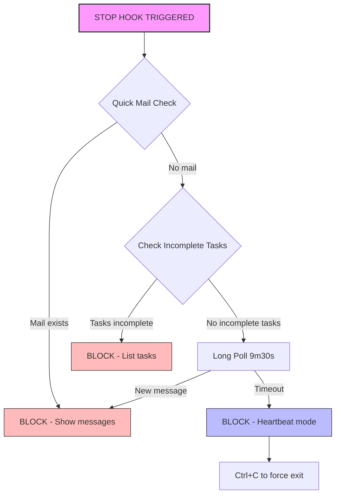
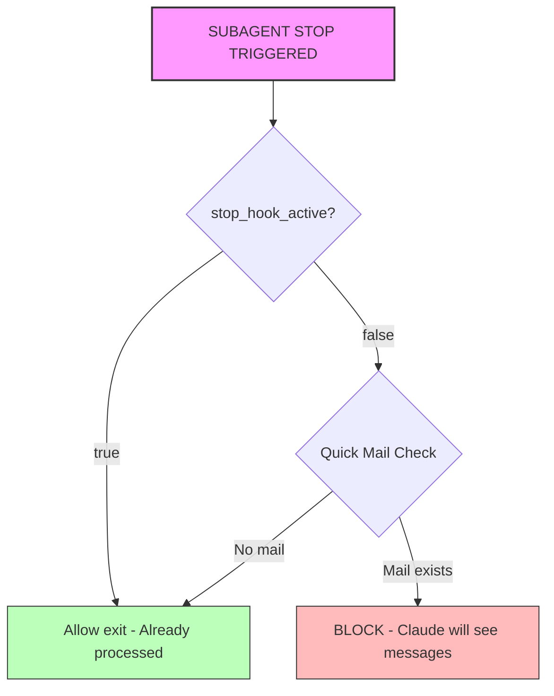
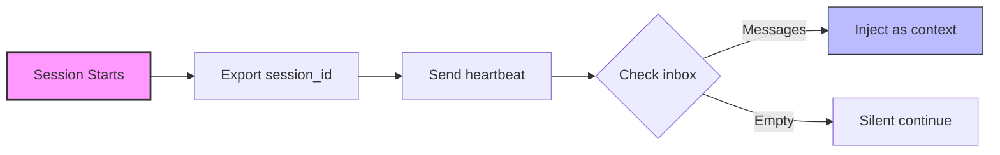
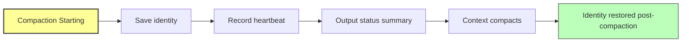
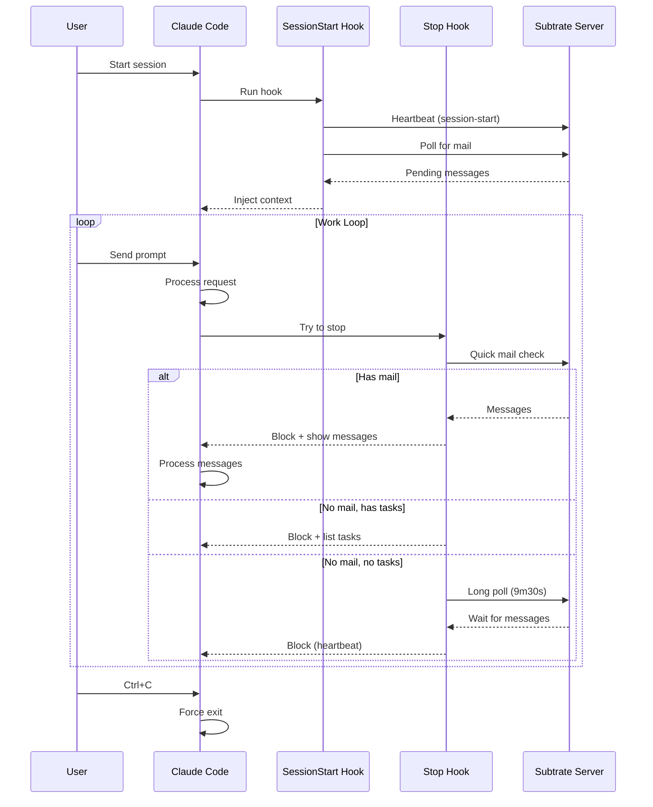
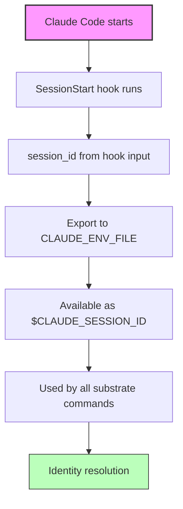

# Subtrate Hooks System

This document describes how Subtrate integrates with Claude Code via hooks,
providing persistent agent behavior and inter-agent communication.

## Overview

Subtrate uses Claude Code's hook system to:
1. Keep agents alive and responsive to messages from other agents
2. Inject incoming messages as context
3. Maintain agent identity across compactions
4. Block exit when work remains incomplete

## Hook Types

| Hook | Trigger | Purpose |
|------|---------|---------|
| **SessionStart** | Claude Code session begins | Heartbeat + inject pending messages |
| **UserPromptSubmit** | User sends a message | Silent heartbeat + check for new mail |
| **Stop** | Main agent tries to exit | **Keep agent alive** - long-poll for work |
| **SubagentStop** | Subagent (Task-spawned) tries to exit | One-shot check - block once if messages exist |
| **PreCompact** | Before context compaction | Save identity state for restoration |

## Installation

```bash
# Install all hooks
substrate hooks install

# Check installation status
substrate hooks status

# Remove hooks
substrate hooks uninstall
```

Hooks are installed to `~/.claude/hooks/substrate/` and registered in
`~/.claude/settings.json`.

---

## Stop Hook (Main Agents)

The Stop hook implements a **Persistent Agent Pattern** that keeps main agents
alive indefinitely, continuously checking for work.

### Behavior Flow



### Key Characteristics

1. **Always blocks by default** - The Stop hook always outputs `{"decision": "block"}`
   to keep the agent alive, even when there are no messages.

2. **Checks mail before tasks** - Mail is more actionable and time-sensitive.

3. **9.5-minute long poll** - Under the 10-minute hook timeout, continuously
   checking for incoming messages.

4. **Ctrl+C force exit** - Users can bypass the hook with Ctrl+C.

### Output Format

The Stop hook outputs JSON in this format:

```json
// When mail exists:
{
  "decision": "block",
  "reason": "You have 2 unread messages:\n- From: User - \"Please review this\"\n- From: AgentX - \"Status update\""
}

// When tasks are incomplete:
{
  "decision": "block",
  "reason": "3 incomplete task(s): #1 [in_progress], #2 [pending]. Complete ALL tasks before stopping."
}

// When in heartbeat mode (no mail, no tasks):
{
  "decision": "block",
  "reason": "No new messages. Agent staying alive (heartbeat). Use Ctrl+C to force exit."
}
```

### Why Always Block?

The persistent agent pattern ensures that agents registered with Subtrate stay
available for inter-agent communication. When Agent A sends a message to Agent B,
Agent B will receive it within seconds (on the next poll cycle) rather than
waiting for the human user to restart Agent B.

---

## SubagentStop Hook (Task-Spawned Agents)

Subagents are spawned via the Task tool and should complete their work and exit,
not stay alive indefinitely like main agents.

### Behavior Flow



### Key Differences from Stop Hook

| Aspect | Stop (Main Agent) | SubagentStop |
|--------|-------------------|--------------|
| Long poll | Yes (9m30s) | No |
| Default decision | Always block | Allow exit if no mail |
| Task checking | Yes | No |
| Purpose | Stay alive indefinitely | Complete work and exit |

### The stop_hook_active Flag

Claude Code sets `stop_hook_active: true` in the hook input when the agent is
trying to stop after a previous hook block. This allows subagents to:

1. First stop: Check for mail, block if any
2. Second stop (after processing): Allow exit

---

## SessionStart Hook

Runs when a Claude Code session begins.

### What It Does



1. **Exports session ID** - Writes `CLAUDE_SESSION_ID` to `$CLAUDE_ENV_FILE`
2. **Sends heartbeat** - Marks the agent as active with `--session-start`
3. **Checks for mail** - Outputs pending messages as context

### Output

Plain text injected as context at session start:

```
📬 You have 2 unread messages:
- From: User (urgent) - "Deploy fix to production"
- From: AgentX - "Code review complete"

Use `substrate inbox` to read full messages.
```

---

## UserPromptSubmit Hook

Runs each time the user submits a prompt.

### What It Does

1. **Silent heartbeat** - Updates last active time
2. **Checks for new mail** - Injects as context if any

### Output

Quiet if no messages. If messages exist:

```
📬 New message from AgentX: "Build completed successfully"
```

---

## PreCompact Hook

Runs before context compaction.

### What It Does



1. **Saves identity** - `substrate identity save`
2. **Records heartbeat** - Updates last active time
3. **Outputs status** - Summary for post-compaction context

---

## Hook Input Format

All hooks receive JSON input via stdin:

```json
{
  "session_id": "abc123-def456",
  "stop_hook_active": false,
  "hook_type": "Stop"
}
```

### Key Fields

- `session_id` - Claude Code session identifier (critical for agent identity)
- `stop_hook_active` - True if Claude is stopping after a previous block
- `hook_type` - The type of hook being executed

---

## Agent Lifecycle



---

## Session ID Flow



---

## Troubleshooting

### Agent Can't Check Mail

**Symptom:** Hook shows "Need to check session ID" or similar errors.

**Cause:** The `session_id` isn't being passed to substrate commands.

**Solution:** Ensure hooks pass `--session-id` flag:
```bash
substrate poll --session-id "$session_id" --format hook
```

### Hooks Seem Outdated

**Symptom:** Hooks don't have expected behavior after updates.

**Cause:** Hook scripts are embedded at build time. Old CLI has old hooks.

**Solution:**
```bash
# Reinstall hooks with updated CLI
make build-all && make install
substrate hooks install
```

### Agent Exits Unexpectedly

**Symptom:** Agent doesn't stay alive, exits without checking mail.

**Cause:** Hook might be erroring silently.

**Debug:**
```bash
# Test stop hook manually
echo '{"session_id": "'$CLAUDE_SESSION_ID'"}' | ~/.claude/hooks/substrate/stop.sh
```

### Identity Not Found

**Symptom:** "no agent specified" or identity errors.

**Cause:** Session ID not being passed, or identity file doesn't exist.

**Solution:**
```bash
# Check if identity exists
ls ~/.subtrate/identities/by-session/

# Manually ensure identity
substrate identity current --session-id "$CLAUDE_SESSION_ID"
```

---

## Debugging Hooks

### Manual Hook Testing

```bash
# Test stop hook
echo '{"session_id": "test-123"}' | ~/.claude/hooks/substrate/stop.sh

# Test session start hook
echo '{"session_id": "test-123"}' | ~/.claude/hooks/substrate/session_start.sh

# Test with your actual session ID
echo '{"session_id": "'$CLAUDE_SESSION_ID'"}' | ~/.claude/hooks/substrate/stop.sh
```

### Verbose Mode

```bash
# Add debugging to hook script temporarily
set -x  # Enable bash trace mode

# Or check substrate commands directly
substrate poll --session-id "$session_id" --format hook --verbose
```

### Check Hook Registration

```bash
# View registered hooks
cat ~/.claude/settings.json | jq '.hooks'

# Verify hook files exist
ls -la ~/.claude/hooks/substrate/
```

---

## Architecture Notes

### Why Hooks Instead of Daemon?

Claude Code doesn't have a persistent daemon model. Hooks provide the only
mechanism to:
- Inject context before the agent responds
- Block exit when work remains
- Maintain state across sessions

### Hook Timeout

Claude Code command hooks have a default 10-minute (600-second) timeout. The
Stop hook's 9.5-minute (570-second) long poll stays under this limit while
maximizing the time agents stay alive waiting for work. The timeout is
explicitly set to 600 seconds in the hook configuration.

---

## Configuration

Hooks are configured in `~/.claude/settings.json`:

```json
{
  "hooks": {
    "Stop": [
      {
        "matcher": {},
        "hooks": [
          {
            "type": "command",
            "command": "~/.claude/hooks/substrate/stop.sh"
          }
        ]
      }
    ],
    "SubagentStop": [...],
    "SessionStart": [...],
    "UserPromptSubmit": [...],
    "PreCompact": [...]
  }
}
```

To modify hook behavior, edit the scripts in `~/.claude/hooks/substrate/`.
