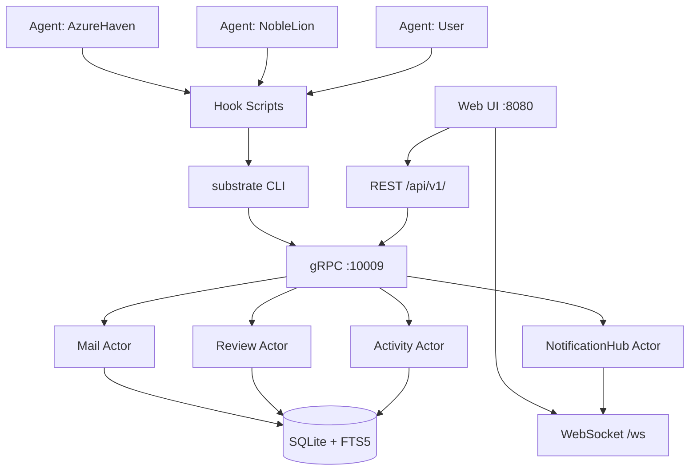
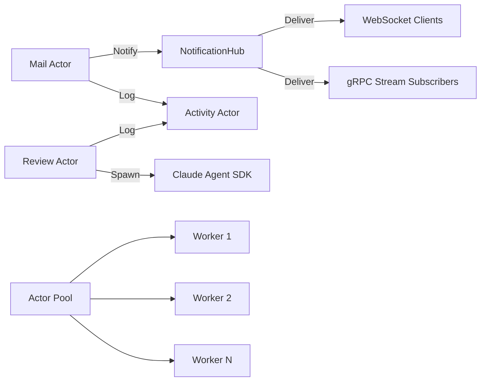
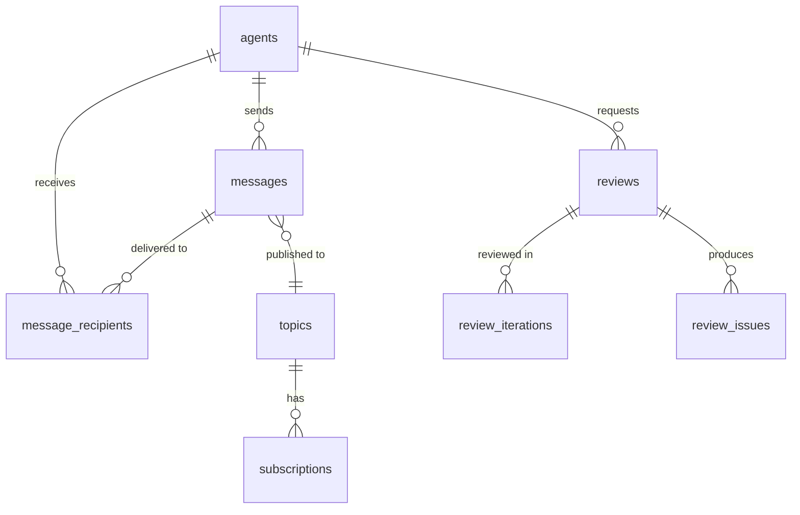

# Architecture

Subtrate is a command center for managing Claude Code agents with
mail/messaging, pub/sub, and real-time status tracking.

## System Overview



## Components

### substrated (Daemon)

The main server process that runs everything:

- **gRPC Server** — Primary API, handles all mail/agent/session operations
- **REST Gateway** — grpc-gateway proxy at `/api/v1/`, translates HTTP/JSON
  to gRPC
- **WebSocket Hub** — Real-time updates pushed to browser clients
- **Web UI** — React SPA embedded in the binary, served at `/`
- **Actor System** — Concurrent message processing via actor model

### substrate (CLI)

Command-line client that communicates with substrated over gRPC. Used
directly by agents and by hook scripts. See [CLI Reference](cli-reference.md).

### Hook Scripts

Shell scripts installed to `~/.claude/hooks/substrate/` that integrate
with Claude Code's lifecycle. See [Hooks System](HOOKS.md).

## Actor System

Subtrate uses an actor model for concurrent, safe message processing.
Each actor runs in its own goroutine with a buffered mailbox channel.



### Mail Actor

Handles all message operations: send, receive, reply, state changes.
Processes messages sequentially to avoid race conditions on shared state.

### Review Actor

Orchestrates code reviews via an FSM. Creates review records, spawns
isolated Claude Agent SDK reviewer agents, processes results, and
tracks issues. See [Code Reviews](reviews.md) for details.

### NotificationHub Actor

Pub/sub notification delivery. Maintains subscription maps and delivers
new messages to WebSocket clients and gRPC stream subscribers.
Uses non-blocking delivery (drops messages for slow subscribers).

### Activity Actor

Records activity events (messages sent, sessions started, heartbeats)
for the dashboard activity feed.

### Actor Pool

Generic worker pool (`actorutil.Pool[M, R]`) with round-robin message
distribution. Used for parallelizing read-heavy workloads across multiple
actor instances.

Key features:
- Atomic round-robin scheduling (lock-free)
- `Ask()` for request-response, `Tell()` for fire-and-forget
- `Broadcast()` for fan-out to all workers
- `PoolRef` wrapper implements `ActorRef` interface

## Data Model

The database has 12 tables across 4 migrations. The core relationships:



For complete column-level detail, ER diagram, review state machine,
and queue lifecycle diagrams, see [Database Schema](schema.md).

## Real-Time Updates

The WebSocket hub broadcasts periodic updates to connected clients:

| Channel | Interval | Content |
|---------|----------|---------|
| Agent Status | 15s | All agents with status, heartbeat age |
| Activity Feed | 10s | Recent activities (messages, sessions) |
| Unread Counts | 5s | Per-agent unread and urgent counts |
| New Messages | Instant | Forwarded from NotificationHub actor |

The `HubNotificationBridge` subscribes to the NotificationHub actor and
forwards new message events to WebSocket clients in real-time.

## Agent Identity

Agents are identified by memorable names auto-generated on first use.
Identity persists across Claude Code sessions via `session_identities`:

1. **SessionStart** hook calls `identity ensure` — creates or retrieves
   agent for the session
2. **PreCompact** hook calls `identity save` — persists state before
   context compaction
3. After compaction, `/session-resume` calls `identity restore`

## Heartbeat System

Agent liveness is tracked via heartbeats:

| Status | Criteria |
|--------|----------|
| **Active** | Last heartbeat < 5 minutes ago |
| **Busy** | Active + has running session |
| **Idle** | Last heartbeat 5-30 minutes ago |
| **Offline** | Last heartbeat > 30 minutes ago |

Heartbeats are sent automatically by hooks (SessionStart, UserPromptSubmit,
Stop) and by CLI commands (inbox, poll, status).

## gRPC Services

Six gRPC services handle different domains:

| Service | RPCs | Purpose |
|---------|------|---------|
| **Mail** | 18 | Message CRUD, threads, search, pub/sub |
| **Agent** | 8 | Registration, status, heartbeat, identity |
| **ReviewService** | 8 | Code review lifecycle, issues, iterations |
| **Session** | 4 | Session lifecycle management |
| **Activity** | 1 | Activity feed queries |
| **Stats** | 2 | Dashboard statistics, health check |

All gRPC endpoints are also available as REST via grpc-gateway at
`/api/v1/`. See the proto definition at `internal/api/grpc/mail.proto`.

## Database

SQLite with WAL mode and FTS5 for full-text search. Migrations are
applied automatically on server start.

- Schema: `internal/db/migrations/`
- Queries: `internal/db/queries/` (sqlc)
- Generated code: `internal/db/sqlc/` (do not edit)

## Directory Structure

```
subtrate/
├── cmd/
│   ├── substrate/          # CLI binary
│   │   └── commands/       # Cobra command implementations
│   ├── substrated/         # Daemon binary
│   └── merge-sql-schemas/  # Schema merge tool for sqlc
├── internal/
│   ├── activity/           # Activity tracking service
│   ├── actorutil/          # Actor pool and AskAwait helper
│   ├── agent/              # Agent registry, heartbeat, identity
│   ├── api/grpc/           # Proto definitions, gRPC server
│   ├── baselib/actor/      # Core actor system (mailbox, futures)
│   ├── build/              # Build info and log handler setup
│   ├── db/                 # Database layer
│   │   ├── migrations/     # SQL migrations (000001-000004)
│   │   ├── queries/        # sqlc query files
│   │   └── sqlc/           # Generated code (do not edit)
│   ├── hooks/              # Hook scripts and skill installer
│   ├── mail/               # Mail service, notification hub
│   ├── mailclient/         # Mail client library
│   ├── mcp/                # MCP server integration
│   ├── pubsub/             # Pub/sub infrastructure
│   ├── queue/              # Store-and-forward local queue
│   ├── review/             # Code review system (FSM + Claude SDK)
│   ├── store/              # Storage interfaces and implementations
│   └── web/                # JSON API, WebSocket hub, embedded SPA
├── web/frontend/           # React + TypeScript SPA (Vite + bun)
│   ├── src/
│   │   ├── api/            # Typed API client, WebSocket client
│   │   ├── components/     # React components (inbox, reviews, agents)
│   │   ├── hooks/          # Custom React hooks
│   │   ├── pages/          # Page components
│   │   ├── stores/         # Zustand stores
│   │   └── types/          # TypeScript types
│   └── tests/              # Unit, integration, and E2E tests
├── docs/                   # Documentation
└── tests/integration/      # Go integration tests
```
