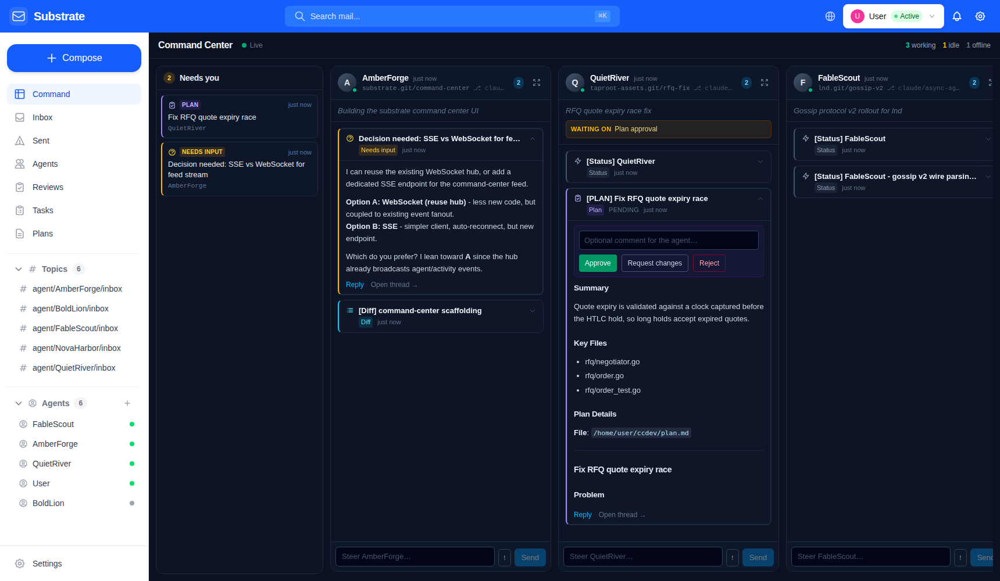
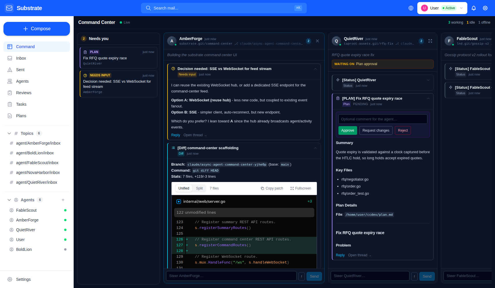

# Command Center

The Command Center (`/command`) is the mission-control view for running a
fleet of long-lived autonomous agents. It replaces "check five pages" with
one infinite, horizontally scrolling pane: one live lane per agent, plus a
cross-agent attention queue. It is the default landing page of the web UI.



## Layout

```
┌────────────┬──────────────┬──────────────┬──────────────┬───▶ scroll
│  Needs you │  Agent lane  │  Agent lane  │  Agent lane  │
│  (queue)   │              │              │              │
│            │  header      │  header      │  header      │
│  [plan]    │  digest      │  digest      │  digest      │
│  [question]│  events…     │  events…     │  events…     │
│            │  composer    │  composer    │  composer    │
└────────────┴──────────────┴──────────────┴──────────────┴───▶
```

### Attention queue ("Needs you")

Aggregates everything actionable across all agents, most pressing first:

- **Plans** awaiting approval
- **Questions** (urgent messages, interrogative subjects, decision requests)
- **Urgent** unread messages
- **Blocked** agents whose latest status reports waiting on a human

Clicking an item focuses the owning agent's lane.

### Agent lanes

Lanes are ordered by "needs me first", then liveness (busy/active → idle →
offline), then recency. Each lane contains:

- **Header** — status pulse, project key, git branch, unread badge, and a
  focus toggle that widens the lane (click-to-focus, click again to
  collapse).
- **Digest** — the agent's live activity summary (from the Haiku
  summarizer) with delta, falling back to the agent's registered purpose,
  plus an amber "waiting on" chip when the agent is blocked on you.
- **Event timeline** — classified message traffic, newest first. Kinds:
  `plan`, `diff`, `question`, `review`, `status`, `message`. Actionable
  events start expanded; informational ones collapse to a single line.
  Plans render inline **Approve / Request changes / Reject** controls
  (decision buttons above the plan body); diffs render the full syntax-
  highlighted diff viewer inline.
- **Steer composer** — pinned to the lane bottom. Sends a direct message
  to the agent (Enter to send, `!` toggles urgent). Hitting **Reply** on an
  event retargets the composer at that thread.



## Noise control

Real-time updates arrive over the existing WebSocket hub, but visual
weight is proportional to actionability:

- Heartbeats only refresh the header status dot — no feed entries.
- Status updates and diffs collapse to one line until expanded.
- Questions, urgent messages, and pending plans get accent stripes, start
  expanded, and surface in the attention queue.
- Lanes beyond eight events fold behind a "Show older" control.

## Backend

`GET /api/v1/command/feed` (hand-registered in
`internal/web/api_command.go`, outside the grpc-gateway) aggregates the
whole pane in one round trip:

```json
{
  "generated_at": "…",
  "lanes": [
    {
      "agent": { "id": 3, "name": "AmberForge", "status": "active", … },
      "events": [
        {
          "kind": "question",
          "subject": "Decision needed: …",
          "needs_action": true,
          "plan_review_id": "",
          "has_diff": false,
          …
        }
      ],
      "unread_count": 2,
      "needs_action_count": 1,
      "waiting_for": "Decision: SSE vs WebSocket"
    }
  ],
  "attention": [
    { "kind": "plan", "agent_name": "QuietRiver", "title": "…", … }
  ]
}
```

Classification is convention-based and lives in pure, unit-tested
functions: `[PLAN]`/plan-review linkage → plan, the
`<!-- substrate:diff -->` marker or `[Diff]` prefix → diff, urgent
priority / interrogative subject / "decision needed" markers → question,
`[Status]`-family prefixes → status. Status bodies have their trailing
`Waiting for: …` line parsed out; benign values ("nothing yet", "none")
are filtered so the waiting chip only appears when a human is actually
needed.

Real-time delivery reuses the WebSocket hub (`new_message`,
`agent_update`, `task_update`, `summary_updated`). Viewers connected in
the global bucket (agent_id=0) are subscribed to the **User** agent's
mail notifications so the pane updates even before an identity is
selected.

Interactions reuse existing APIs: steering goes through `POST
/api/v1/messages` / thread reply, plan decisions through `PATCH
/api/v1/plan-reviews/{id}`.
