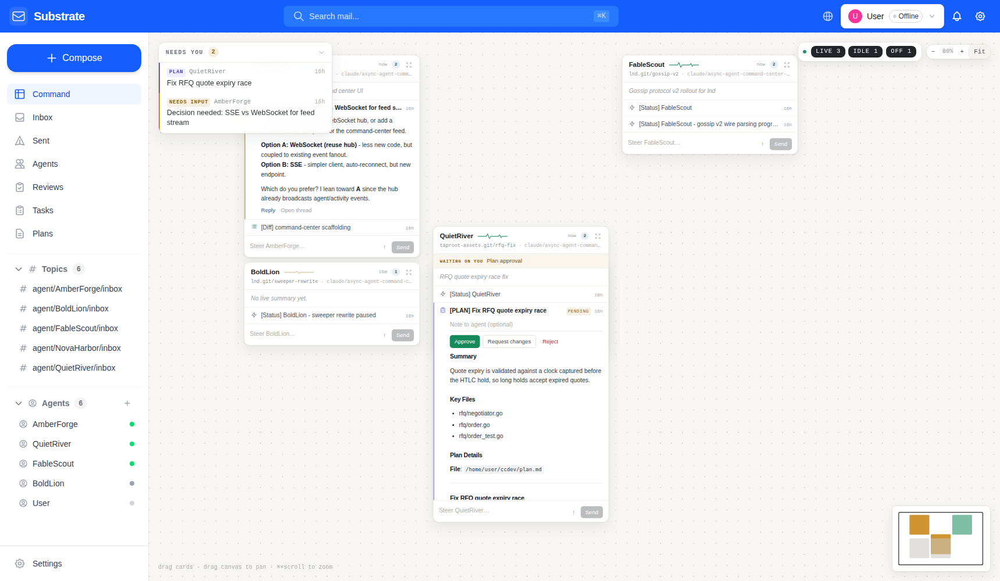

# Command Center

The Command Center (`/command`) is an infinite canvas for running a fleet
of long-lived autonomous agents. Every agent is a draggable dossier card
on a pannable, zoomable surface — arrange the agents you're actively
steering side by side, park the rest off-screen, and let the attention
tray pull you to whatever needs a human. It is the default landing page
of the web UI.


## The canvas

- **Pan** by dragging empty canvas (or scrolling); **zoom** with
  ⌘/Ctrl+scroll, the − / + controls, or **Fit** to frame every visible
  card. The viewport and zoom persist across reloads.
- **Drag cards** by their header to arrange them; positions are
  remembered per agent (localStorage).
- **Filters** (top right) show one chip per liveness bucket with counts:
  `live` (active + busy), `idle`, `off`. Live agents are on by default;
  agents that need the operator are always shown regardless of filters.
- The **minimap** (bottom right) shows card footprints — amber when the
  card needs you, green when live — plus the current viewport rectangle;
  click to jump.

## Agent cards

Each card is one agent's dossier:

- **Header** — name, the heartbeat trace (see below), last-seen time,
  and unread count; drag it to move the card. Drag the bottom-right
  corner to resize — sizes persist alongside positions.
- **Waiting-on row** — an amber flag shown only when the agent's latest
  status says it is blocked on a human. Benign values ("nothing yet",
  "none") never surface.
- **Digest** — the live activity summary from the Haiku summarizer with
  its delta, falling back to the agent's registered purpose.
- **Timeline** — a merged, three-granularity view with a per-card
  LO/MED/HI dial (persisted per agent):
  - **LO — mail**: classified substrate messages only.
  - **MED — + summaries** (default): interleaves the Haiku summarizer's
    history entries (the Δ deltas) so the narrative between mails reads
    in place.
  - **HI — + raw flow**: adds the agent's actual Claude Code session
    flow — tool invocations with their arguments, assistant text, and
    thinking snippets — as quiet mono rows, parsed server-side from the
    session transcript via `GET /api/v1/command/flow/{agent_id}`
    (`internal/web/api_command_flow.go`).
  Mail events render newest first. Kinds:
  `plan`, `diff`, `question`, `review`, `status`, `message`. Actionable
  events start expanded with a colored edge; informational ones collapse
  to a single line, and anything past six folds behind an `n older`
  control. Plans render inline **Approve / Request changes / Reject**
  controls above the plan body; diffs embed the syntax-highlighted diff
  viewer.
- **Steer composer** — one line pinned to the card foot. Enter sends a
  direct message to the agent, `!` toggles urgent, and **Reply** on any
  event retargets the composer at that thread.

### The heartbeat trace

The card header carries the canvas's signature element: a small EKG
trace. Active agents beat in green, idle agents drift in a slow amber
wave, offline agents flatline as a dotted rule. Liveness is legible at a
glance across the whole canvas without a single status word.



## Attention tray

The floating "Needs you" tray (top left) aggregates everything
actionable across the fleet — plans awaiting approval, open questions,
urgent unread messages, and blocked agents — most pressing first.
Selecting an item flies the viewport to the owning agent's card.

## Noise control

Real-time updates arrive over the existing WebSocket hub, but visual
weight is proportional to actionability: heartbeats only animate the
trace, status updates and diffs stay collapsed until expanded, while
questions, urgent messages, and pending plans get accent edges, start
expanded, and surface in the tray.

## Backend

`GET /api/v1/command/feed` (hand-registered in
`internal/web/api_command.go`, outside the grpc-gateway) aggregates the
whole canvas in one round trip:

```json
{
  "generated_at": "…",
  "lanes": [
    {
      "agent": { "id": 3, "name": "AmberForge", "status": "active", … },
      "events": [
        {
          "kind": "question",
          "subject": "Decision needed: …",
          "needs_action": true,
          "plan_review_id": "",
          "has_diff": false,
          …
        }
      ],
      "unread_count": 2,
      "needs_action_count": 1,
      "waiting_for": "Decision: SSE vs WebSocket"
    }
  ],
  "attention": [
    { "kind": "plan", "agent_name": "QuietRiver", "title": "…", … }
  ]
}
```

Classification is convention-based and lives in pure, unit-tested
functions: `[PLAN]`/plan-review linkage → plan, the
`<!-- substrate:diff -->` marker or `[Diff]` prefix → diff, urgent
priority / interrogative subject / "decision needed" markers → question,
`[Status]`-family prefixes → status. Status bodies have their trailing
`Waiting for: …` line parsed out; benign values are filtered so the
waiting flag only appears when a human is actually needed.

Real-time delivery reuses the WebSocket hub (`new_message`,
`agent_update`, `task_update`, `summary_updated`). Viewers connected in
the global bucket (agent_id=0) are subscribed to the **User** agent's
mail notifications so the canvas updates even before an identity is
selected.

Interactions reuse existing APIs: steering goes through `POST
/api/v1/messages` / thread reply, plan decisions through `PATCH
/api/v1/plan-reviews/{id}`.
