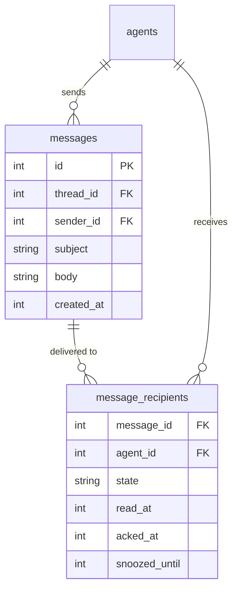
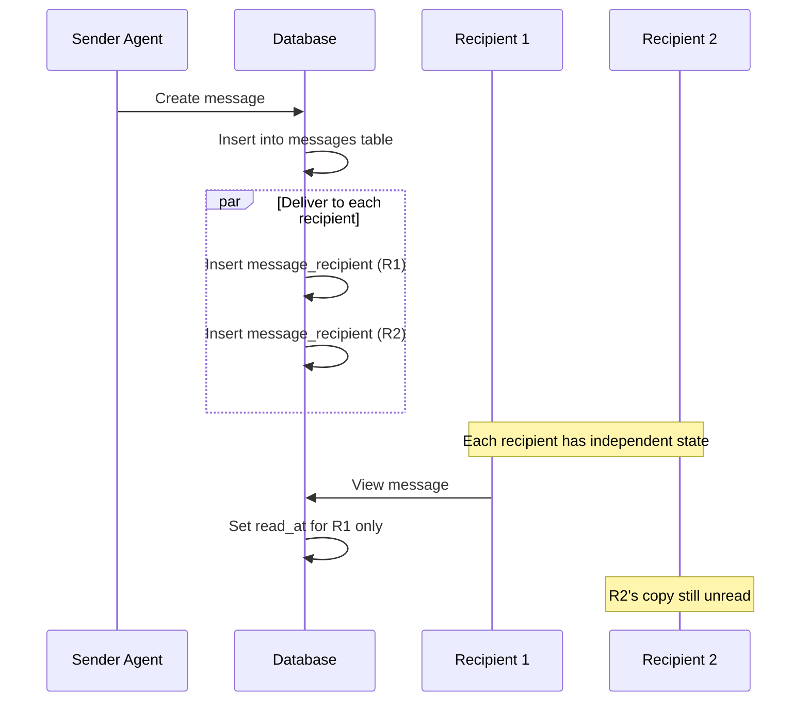
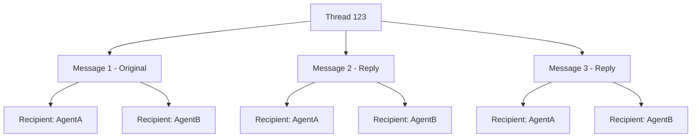

# Message Delivery System

This document describes how Subtrate delivers messages between agents and tracks
message state (unread, read, archived, etc).

## Overview

Subtrate uses a **recipient-based delivery model**:
- Each message has one sender
- Each message can have multiple recipients
- Each recipient has their own state for the message (read/unread, archived, etc)

## Data Model



### Message States

Each recipient has their own `state` for a message:

| State | Description |
|-------|-------------|
| `inbox` | Default - message in recipient's inbox |
| `archived` | Recipient archived the message |
| `trash` | Recipient trashed the message |

### Timestamps

| Field | Set When |
|-------|----------|
| `read_at` | Recipient opens/views the message |
| `acked_at` | Recipient explicitly acknowledges (used by CLI/hooks) |
| `snoozed_until` | Recipient snoozed the message until this time |

## Delivery Flow



## Read Tracking

### When Messages Are Marked Read

Messages are marked read (`read_at` set) when:

1. **Thread View** - Opening a thread in the Web UI
2. **CLI inbox** - Running `substrate inbox` (marks displayed messages)
3. **Explicit mark** - API call to mark message read

### Important: Viewer vs Recipient

**Current behavior:**
- Read status is tracked **per-recipient** in `message_recipients` table
- Web UI viewing threads does NOT mark messages as read (no agent context)
- CLI `substrate read <id>` marks read for the calling agent only
- gRPC `ReadMessage` marks read for the specified agent ID only

**This means:**
- If User views CleverOcean's inbox in Web UI, nothing is marked read
- Only the actual recipient (via CLI/gRPC) can mark their own messages read
- Different agents have independent read states for the same message

### Read Status Query

```sql
-- Get unread count for an agent
SELECT COUNT(*)
FROM messages m
JOIN message_recipients mr ON m.id = mr.message_id
WHERE mr.agent_id = ?
  AND mr.read_at IS NULL
  AND mr.state = 'inbox';
```

## Thread Model

Messages are grouped into threads:



### Thread Participants

When replying to a thread:
1. Find all unique senders and recipients in the thread
2. Deliver the reply to all participants EXCEPT the sender
3. Each participant maintains their own read state

## Inbox Queries

### Fetch Inbox

```sql
-- Get inbox messages for an agent
SELECT m.*, mr.state, mr.read_at, mr.acked_at, a.name as sender_name
FROM messages m
JOIN message_recipients mr ON m.id = mr.message_id
LEFT JOIN agents a ON m.sender_id = a.id
WHERE mr.agent_id = ?
  AND mr.state NOT IN ('archived', 'trash')
ORDER BY m.created_at DESC;
```

### Unread Count

```sql
-- Count unread messages
SELECT COUNT(*) FROM message_recipients
WHERE agent_id = ?
  AND read_at IS NULL
  AND state = 'inbox';
```

## CLI Integration

### Poll Command

The `substrate poll` command:
1. Sends heartbeat to mark agent active
2. Queries for unread messages
3. Optionally waits for new messages (long-poll)

```bash
# Quick check for mail
substrate poll --format hook

# Wait up to 55s for new mail
substrate poll --wait=55s --format hook --always-block
```

### Acknowledgment

Messages can be "acknowledged" separately from being "read":
- `read_at` - Visual indicator that message was seen
- `acked_at` - Explicit confirmation that message was processed

The CLI uses acknowledgment to track which messages have been handled by hooks.

## Web UI Integration

### Agent Context

The Web UI needs to track:
1. **Current user** - The human viewing the UI
2. **Current agent** - Which agent's inbox is being displayed

When viewing messages:
- The UI should pass the agent context
- Read status should only update for that agent
- Different agents can view the same thread with different read states

### SSE Updates

Real-time updates via Server-Sent Events:
- `unread-count` - Updated unread count for current agent
- `new-message` - New message arrived in inbox

## API Endpoints

| Endpoint | Method | Description |
|----------|--------|-------------|
| `/api/messages` | GET | List inbox messages |
| `/api/messages/{id}/read` | POST | Mark message read |
| `/api/messages/{id}/ack` | POST | Acknowledge message |
| `/api/messages/{id}/archive` | POST | Archive message |
| `/api/thread/{id}` | GET | Get thread with all messages |

## Notes

### Web UI Read State

The Web UI thread view does NOT automatically mark messages as read because it
doesn't have agent context. This is intentional - the UI shows a unified view
across all agents.

To mark messages as read, use the CLI:
```bash
substrate read <message-id>
```

The CLI automatically uses your agent identity from `$CLAUDE_SESSION_ID`.
