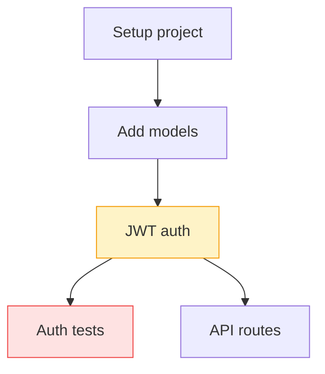

# feat: View active tasks for agents in web UI with hook-based tracking

## Summary

Enable viewing of active tasks for agents in the Substrate web UI by intercepting Claude Code's native task management tools (`TaskCreate`, `TaskUpdate`, `TaskGet`, `TaskList`) through hooks and replicating task state in the backend database.

## Background: Claude Code's Native Task System

Claude Code provides **four dedicated tools** for task management, with tasks persisted to disk at `~/.claude/tasks/{listID}/` as JSON files.

### Storage & Persistence

| Aspect | Details |
|--------|---------|
| **Location** | `~/.claude/tasks/{listID}/` |
| **Format** | JSON files, one per task |
| **Shared Lists** | `CLAUDE_CODE_TASK_LIST_ID` env var enables shared lists across CLI/SDK |
| **Locking** | FileTaskStore uses flock-based locking on Unix |
| **Test Support** | MemoryTaskStore for testing |

### TaskCreate
Creates a new task with structured metadata:

```
TaskCreate(
    subject: "Implement JWT authentication middleware"
    description: "Add JWT validation to the API routes.
                  Verify tokens, extract user claims,
                  attach to request context."
    activeForm: "Implementing JWT authentication"
    metadata: {"feature": "auth", "phase": "2.1"}
)
```

| Parameter | Required | Description |
|-----------|----------|-------------|
| `subject` | Yes | Brief imperative title ("Implement X", "Add Y", "Fix Z") |
| `description` | Yes | Detailed requirements and acceptance criteria |
| `activeForm` | No | Present-tense form shown in spinner ("Implementing X") |
| `metadata` | No | Arbitrary key-value pairs for tracking |

### TaskUpdate
Manages task state and dependencies:

```
TaskUpdate(
    taskId: "task-123"
    status: "in_progress"
    addBlockedBy: ["task-122"]
)
```

| Parameter | Description |
|-----------|-------------|
| `status` | "pending" → "in_progress" → "completed" |
| `addBlocks` | Tasks that cannot start until this one completes |
| `addBlockedBy` | Tasks that must complete before this one starts |
| `owner` | Assign to a specific agent |

### TaskGet
Retrieves full details for a specific task including dependency relationships.

### TaskList
Returns all tasks with current status:
- `id`: unique identifier
- `subject`: task title
- `status`: pending | in_progress | completed
- `owner`: assigned agent (if any)
- `blockedBy`: list of blocking task IDs

**Task availability**: A task is "available" when `status = "pending"`, `owner = null`, and `blockedBy = []`.

### Multi-Agent Coordination

The task system supports multi-agent workflows:
- Agents **claim tasks** by setting `owner` field + `status: "in_progress"`
- **Available tasks** = `pending` + no owner + no blocking dependencies
- Enables work distribution across multiple Claude instances
- Automatic unblocking when blocking tasks complete

### Task Lifecycle

```
┌─────────┐     TaskUpdate      ┌─────────────┐     TaskUpdate      ┌───────────┐
│ pending │ ──────────────────► │ in_progress │ ──────────────────► │ completed │
└─────────┘   status + owner    └─────────────┘       status        └───────────┘
     │                                │                                    │
     │         TaskUpdate             │          TaskUpdate               │
     └────────── delete ──────────────┴─────────── delete ────────────────┘
```

**Best Practice**: Always set `in_progress` before starting work, `completed` when done.

## Problem Statement

Claude Code's task system has limited external visibility:
- No way to see what tasks an agent is working on from the web UI
- No historical record of task completion patterns
- No visibility into task dependencies and blockers across agents
- Web dashboard can't show real-time task progress

## Proposed Solution

We have **two complementary approaches** for task visibility:

### Approach A: Direct File Watching

Since tasks persist to `~/.claude/tasks/{listID}/`, we can directly read/watch these files:

```go
// TaskFileWatcher watches task directories for changes
type TaskFileWatcher struct {
    taskDir   string
    watcher   *fsnotify.Watcher
    onChange  func(listID string, tasks []Task)
}

func (w *TaskFileWatcher) Watch(listID string) error {
    taskPath := filepath.Join(w.taskDir, listID)
    return w.watcher.Add(taskPath)
}

// On file change, read all tasks and sync to database
func (w *TaskFileWatcher) handleChange(listID string) {
    tasks := w.readTaskFiles(listID)
    w.onChange(listID, tasks)
}
```

**Advantages:**
- No hook configuration needed
- Works retroactively on existing tasks
- Can poll periodically as fallback
- Captures all changes, even from SDK usage

**Disadvantages:**
- Requires filesystem access to `~/.claude/`
- Need to know which listIDs to watch
- File format may change

### Approach B: Hook Interception

Intercept task tool calls via PreToolUse/PostToolUse hooks:

```json
{
  "hooks": {
    "PostToolUse": [
      {
        "matcher": "TaskCreate|TaskUpdate",
        "hooks": [{
          "type": "command",
          "command": "substrate tasks sync --session \"$SESSION_ID\""
        }]
      }
    ]
  }
}
```

**Advantages:**
- Real-time notification on changes
- Works across machines (with substrate daemon)
- Hook can enrich with session context

**Disadvantages:**
- Requires hook installation
- Only captures changes after installation

### Recommended: Hybrid Approach

Combine both for maximum reliability:

1. **File Watching** (primary): Watch task directories for any changes
2. **Hook Sync** (secondary): Hooks trigger immediate sync + add session context
3. **Periodic Poll** (fallback): Every 30s, scan for any missed changes

```
┌──────────────────────────────────────────────────────────────────┐
│  Claude Code Session                                             │
│                                                                  │
│  TaskCreate/Update/etc.                                          │
│       │                                                          │
│       ├──► Writes to ~/.claude/tasks/{listID}/                   │
│       │              │                                           │
│       │              ▼                                           │
│       │    ┌─────────────────────┐                               │
│       │    │  fsnotify watcher   │──────┐                        │
│       │    └─────────────────────┘      │                        │
│       │                                 ▼                        │
│       │                          ┌─────────────┐                 │
│       └──► PostToolUse Hook ───► │  Substrate  │──► SSE ──► UI  │
│                (optional)        │  Database   │                 │
│                                  └─────────────┘                 │
└──────────────────────────────────────────────────────────────────┘
```

### 1. File Watcher Implementation (Approach A)

```go
// internal/task/watcher.go

// TaskFileWatcher monitors ~/.claude/tasks/ for changes
type TaskFileWatcher struct {
    baseDir   string              // ~/.claude/tasks/
    watcher   *fsnotify.Watcher
    store     store.Storage
    agentReg  *agent.Registry
    mu        sync.RWMutex
    listIDs   map[string]int64    // listID -> agentID mapping
}

// NewTaskFileWatcher creates a watcher for task files
func NewTaskFileWatcher(store store.Storage, agentReg *agent.Registry) (*TaskFileWatcher, error) {
    w, err := fsnotify.NewWatcher()
    if err != nil {
        return nil, err
    }

    return &TaskFileWatcher{
        baseDir:  filepath.Join(os.Getenv("HOME"), ".claude", "tasks"),
        watcher:  w,
        store:    store,
        agentReg: agentReg,
        listIDs:  make(map[string]int64),
    }, nil
}

// RegisterListID associates a task list with an agent
func (w *TaskFileWatcher) RegisterListID(listID string, agentID int64) error {
    w.mu.Lock()
    w.listIDs[listID] = agentID
    w.mu.Unlock()

    listPath := filepath.Join(w.baseDir, listID)
    if err := os.MkdirAll(listPath, 0755); err != nil {
        return err
    }
    return w.watcher.Add(listPath)
}

// Start begins watching for file changes
func (w *TaskFileWatcher) Start(ctx context.Context) {
    for {
        select {
        case event := <-w.watcher.Events:
            if event.Op&(fsnotify.Write|fsnotify.Create|fsnotify.Remove) != 0 {
                listID := filepath.Base(filepath.Dir(event.Name))
                w.syncListID(ctx, listID)
            }
        case err := <-w.watcher.Errors:
            log.Printf("watcher error: %v", err)
        case <-ctx.Done():
            return
        }
    }
}

// syncListID reads all task files for a listID and updates database
func (w *TaskFileWatcher) syncListID(ctx context.Context, listID string) error {
    w.mu.RLock()
    agentID, ok := w.listIDs[listID]
    w.mu.RUnlock()
    if !ok {
        return nil // Unknown list, ignore
    }

    listPath := filepath.Join(w.baseDir, listID)
    tasks, err := w.readTaskFiles(listPath)
    if err != nil {
        return err
    }

    return w.store.SyncTasks(ctx, agentID, listID, tasks)
}

// readTaskFiles reads all JSON task files in a directory
func (w *TaskFileWatcher) readTaskFiles(dir string) ([]Task, error) {
    var tasks []Task
    entries, err := os.ReadDir(dir)
    if err != nil {
        return nil, err
    }

    for _, entry := range entries {
        if !entry.IsDir() && strings.HasSuffix(entry.Name(), ".json") {
            data, err := os.ReadFile(filepath.Join(dir, entry.Name()))
            if err != nil {
                continue
            }
            var task Task
            if json.Unmarshal(data, &task) == nil {
                tasks = append(tasks, task)
            }
        }
    }
    return tasks, nil
}
```

### 2. Hook Interception (Approach B)

**Hook Configuration (`~/.claude/settings.json`):**
```json
{
  "hooks": {
    "PreToolUse": [
      {
        "matcher": "TaskCreate",
        "hooks": [{
          "type": "command",
          "command": "substrate tasks hook-create --input \"$TOOL_INPUT\" --session \"$SESSION_ID\""
        }]
      },
      {
        "matcher": "TaskUpdate",
        "hooks": [{
          "type": "command",
          "command": "substrate tasks hook-update --input \"$TOOL_INPUT\" --session \"$SESSION_ID\""
        }]
      }
    ],
    "PostToolUse": [
      {
        "matcher": "TaskCreate",
        "hooks": [{
          "type": "command",
          "command": "substrate tasks hook-created --input \"$TOOL_INPUT\" --output \"$TOOL_OUTPUT\" --session \"$SESSION_ID\""
        }]
      },
      {
        "matcher": "TaskList",
        "hooks": [{
          "type": "command",
          "command": "substrate tasks hook-list --output \"$TOOL_OUTPUT\" --session \"$SESSION_ID\""
        }]
      }
    ]
  }
}
```

### 2. Data Flow

```
┌─────────────────────────────────────────────────────────────────┐
│  Claude Code Session                                            │
│                                                                 │
│  TaskCreate(subject, description, ...)                          │
│       │                                                         │
│       ├──► PreToolUse Hook ──► substrate tasks hook-create      │
│       │                              │                          │
│       │                              ▼                          │
│       │                        ┌─────────────┐                  │
│       │                        │  Substrate  │                  │
│       │                        │  Database   │                  │
│       │                        └─────────────┘                  │
│       │                              ▲                          │
│       ├──► PostToolUse Hook ─► substrate tasks hook-created     │
│       │         (captures task_id from output)                  │
│       ▼                                                         │
│  TaskUpdate(taskId, status: "in_progress")                      │
│       │                                                         │
│       └──► PreToolUse Hook ──► substrate tasks hook-update      │
│                                      │                          │
│                                      ▼                          │
│                                ┌─────────────┐                  │
│                                │  Substrate  │──► SSE ──► Web UI│
│                                │  Database   │                  │
│                                └─────────────┘                  │
└─────────────────────────────────────────────────────────────────┘
```

### 3. Database Schema

```sql
-- Migration: 000008_agent_tasks.up.sql

-- Table for tracking registered task lists
CREATE TABLE task_lists (
    id INTEGER PRIMARY KEY,
    list_id TEXT NOT NULL UNIQUE,           -- Claude's list ID (from CLAUDE_CODE_TASK_LIST_ID)
    agent_id INTEGER NOT NULL REFERENCES agents(id),
    watch_path TEXT NOT NULL,               -- Full path to ~/.claude/tasks/{list_id}/
    created_at INTEGER NOT NULL,
    last_synced_at INTEGER                  -- Last time we synced from files
);

CREATE INDEX idx_task_lists_agent ON task_lists(agent_id);

-- Table for individual tasks
CREATE TABLE agent_tasks (
    id INTEGER PRIMARY KEY,

    -- Ownership
    agent_id INTEGER NOT NULL REFERENCES agents(id),
    list_id TEXT NOT NULL,                  -- References task_lists.list_id

    -- Claude's task identification
    claude_task_id TEXT NOT NULL,           -- ID from Claude (e.g., "task-123")

    -- Task content (from TaskCreate)
    subject TEXT NOT NULL,                  -- Imperative title
    description TEXT,                       -- Detailed requirements
    active_form TEXT,                       -- Present-tense spinner text
    metadata TEXT,                          -- JSON blob for arbitrary KV pairs

    -- Lifecycle
    status TEXT NOT NULL DEFAULT 'pending', -- pending, in_progress, completed, deleted
    owner TEXT,                             -- Assigned agent name

    -- Dependencies (stored as JSON arrays of task IDs)
    blocked_by TEXT DEFAULT '[]',           -- Tasks blocking this one
    blocks TEXT DEFAULT '[]',               -- Tasks this one blocks

    -- Timestamps
    created_at INTEGER NOT NULL,
    updated_at INTEGER NOT NULL,
    started_at INTEGER,                     -- When moved to in_progress
    completed_at INTEGER,                   -- When moved to completed

    -- File tracking
    file_path TEXT,                         -- Path to the JSON file
    file_mtime INTEGER,                     -- File modification time for change detection

    UNIQUE(list_id, claude_task_id)
);

-- Indexes for common queries
CREATE INDEX idx_agent_tasks_agent_status ON agent_tasks(agent_id, status);
CREATE INDEX idx_agent_tasks_list ON agent_tasks(list_id);
CREATE INDEX idx_agent_tasks_status ON agent_tasks(status) WHERE status NOT IN ('completed', 'deleted');
CREATE INDEX idx_agent_tasks_owner ON agent_tasks(owner) WHERE owner IS NOT NULL;

-- View for available tasks (pending, no owner, no blockers)
CREATE VIEW available_tasks AS
SELECT * FROM agent_tasks
WHERE status = 'pending'
  AND (owner IS NULL OR owner = '')
  AND (blocked_by IS NULL OR blocked_by = '[]');

-- Down migration
DROP VIEW IF EXISTS available_tasks;
DROP TABLE IF EXISTS agent_tasks;
DROP TABLE IF EXISTS task_lists;
```

### 4. gRPC Service Definition

Add task service to `internal/api/grpc/mail.proto`:

```protobuf
// Task service for CLI access
service Tasks {
    // List registration
    rpc RegisterTaskList(RegisterTaskListRequest) returns (RegisterTaskListResponse);
    rpc UnregisterTaskList(UnregisterTaskListRequest) returns (UnregisterTaskListResponse);
    rpc ListTaskLists(ListTaskListsRequest) returns (ListTaskListsResponse);

    // Task operations
    rpc SyncTasks(SyncTasksRequest) returns (SyncTasksResponse);
    rpc ListTasks(ListTasksRequest) returns (ListTasksResponse);
    rpc GetTask(GetTaskRequest) returns (GetTaskResponse);
    rpc GetTaskStats(GetTaskStatsRequest) returns (GetTaskStatsResponse);
    rpc GetTaskDependencies(GetTaskDependenciesRequest) returns (GetTaskDependenciesResponse);

    // Real-time streaming
    rpc WatchTasks(WatchTasksRequest) returns (stream TaskEvent);
}

// === List Registration ===

message RegisterTaskListRequest {
    string list_id = 1;
    string agent_name = 2;
    string watch_path = 3;  // Optional, defaults to ~/.claude/tasks/{list_id}/
}

message RegisterTaskListResponse {
    TaskList task_list = 1;
    int32 initial_task_count = 2;
}

message UnregisterTaskListRequest {
    string list_id = 1;
}

message UnregisterTaskListResponse {}

message ListTaskListsRequest {
    string agent_name = 1;  // Optional filter
}

message ListTaskListsResponse {
    repeated TaskList task_lists = 1;
}

message TaskList {
    int64 id = 1;
    string list_id = 2;
    int64 agent_id = 3;
    string agent_name = 4;
    string watch_path = 5;
    int64 created_at = 6;
    int64 last_synced_at = 7;
    int32 task_count = 8;
}

// === Task Operations ===

message SyncTasksRequest {
    string list_id = 1;
    bool all_lists = 2;     // Sync all registered lists
    string session_id = 3;  // Optional session context
}

message SyncTasksResponse {
    int32 tasks_added = 1;
    int32 tasks_updated = 2;
    int32 tasks_removed = 3;
}

message ListTasksRequest {
    string agent_name = 1;
    string list_id = 2;
    string status = 3;      // pending, in_progress, completed, or empty for all
    bool available_only = 4; // Only tasks with no owner and no blockers
    bool blocked_only = 5;   // Only tasks with blockers
    int32 limit = 6;
    int32 offset = 7;
}

message ListTasksResponse {
    repeated Task tasks = 1;
    TaskStats stats = 2;
    int32 total_count = 3;
}

message GetTaskRequest {
    string list_id = 1;
    string task_id = 2;
}

message GetTaskResponse {
    Task task = 1;
}

message Task {
    int64 id = 1;
    string list_id = 2;
    string claude_task_id = 3;
    string subject = 4;
    string description = 5;
    string active_form = 6;
    string metadata = 7;        // JSON string
    string status = 8;
    string owner = 9;
    repeated string blocked_by = 10;
    repeated string blocks = 11;
    int64 created_at = 12;
    int64 updated_at = 13;
    int64 started_at = 14;
    int64 completed_at = 15;
    int64 elapsed_seconds = 16; // Computed for in_progress tasks
}

message GetTaskStatsRequest {
    string agent_name = 1;
    string list_id = 2;
}

message GetTaskStatsResponse {
    TaskStats stats = 1;
}

message TaskStats {
    int32 pending_count = 1;
    int32 in_progress_count = 2;
    int32 completed_count = 3;
    int32 blocked_count = 4;
    int32 available_count = 5;
    int32 completed_today = 6;
}

message GetTaskDependenciesRequest {
    string list_id = 1;
    string format = 2;  // "json" or "mermaid"
}

message GetTaskDependenciesResponse {
    string data = 1;    // JSON or Mermaid diagram
}

// === Streaming ===

message WatchTasksRequest {
    string agent_name = 1;
    string list_id = 2;
}

message TaskEvent {
    string event_type = 1;  // created, updated, deleted, synced
    Task task = 2;
    int64 timestamp = 3;
}
```

### 5. CLI Client Architecture

The CLI follows the existing pattern with gRPC + direct DB fallback:

```go
// cmd/substrate/commands/tasks.go

type TasksClient interface {
    RegisterTaskList(ctx context.Context, listID, agentName string) (*TaskList, error)
    UnregisterTaskList(ctx context.Context, listID string) error
    ListTaskLists(ctx context.Context, agentName string) ([]*TaskList, error)
    SyncTasks(ctx context.Context, listID string, all bool) (*SyncResult, error)
    ListTasks(ctx context.Context, req *ListTasksRequest) ([]*Task, *TaskStats, error)
    GetTask(ctx context.Context, listID, taskID string) (*Task, error)
    GetTaskStats(ctx context.Context, agentName, listID string) (*TaskStats, error)
    GetTaskDependencies(ctx context.Context, listID, format string) (string, error)
    WatchTasks(ctx context.Context, agentName, listID string) (<-chan *TaskEvent, error)
}

// grpcTasksClient implements TasksClient via gRPC
type grpcTasksClient struct {
    client substraterpc.TasksClient
}

// directTasksClient implements TasksClient via direct DB access
type directTasksClient struct {
    store   store.Storage
    watcher *task.TaskFileWatcher
}

// NewTasksClient returns appropriate client based on daemon availability
func NewTasksClient(cfg *ClientConfig) (TasksClient, error) {
    conn, err := grpc.Dial(cfg.DaemonAddr, grpc.WithInsecure())
    if err == nil {
        // Daemon available, use gRPC
        return &grpcTasksClient{
            client: substraterpc.NewTasksClient(conn),
        }, nil
    }

    // Fallback to direct DB access
    store, err := openDirectStore(cfg)
    if err != nil {
        return nil, err
    }

    watcher, err := task.NewTaskFileWatcher(store, nil)
    if err != nil {
        return nil, err
    }

    return &directTasksClient{
        store:   store,
        watcher: watcher,
    }, nil
}
```

### 6. sqlc Queries

```sql
-- internal/db/queries/tasks.sql

-- name: CreateTask :one
INSERT INTO agent_tasks (
    agent_id, session_id, claude_task_id, subject, description,
    active_form, metadata, status, owner, blocked_by, blocks,
    created_at, updated_at
) VALUES (?, ?, ?, ?, ?, ?, ?, ?, ?, ?, ?, ?, ?)
RETURNING *;

-- name: UpdateTaskStatus :exec
UPDATE agent_tasks
SET status = ?,
    updated_at = ?,
    started_at = CASE WHEN ? = 'in_progress' AND started_at IS NULL THEN ? ELSE started_at END,
    completed_at = CASE WHEN ? = 'completed' THEN ? ELSE completed_at END
WHERE session_id = ? AND claude_task_id = ?;

-- name: UpdateTaskOwner :exec
UPDATE agent_tasks
SET owner = ?, updated_at = ?
WHERE session_id = ? AND claude_task_id = ?;

-- name: AddBlockedBy :exec
UPDATE agent_tasks
SET blocked_by = json_insert(blocked_by, '$[#]', ?),
    updated_at = ?
WHERE session_id = ? AND claude_task_id = ?;

-- name: AddBlocks :exec
UPDATE agent_tasks
SET blocks = json_insert(blocks, '$[#]', ?),
    updated_at = ?
WHERE session_id = ? AND claude_task_id = ?;

-- name: RemoveBlockedBy :exec
UPDATE agent_tasks
SET blocked_by = (
    SELECT json_group_array(value)
    FROM json_each(blocked_by)
    WHERE value != ?
),
updated_at = ?
WHERE session_id = ? AND claude_task_id = ?;

-- name: GetTaskByClaudeID :one
SELECT * FROM agent_tasks
WHERE session_id = ? AND claude_task_id = ?;

-- name: GetTasksByAgent :many
SELECT * FROM agent_tasks
WHERE agent_id = ?
ORDER BY
    CASE status
        WHEN 'in_progress' THEN 0
        WHEN 'pending' THEN 1
        ELSE 2
    END,
    created_at DESC;

-- name: GetActiveTasksByAgent :many
SELECT * FROM agent_tasks
WHERE agent_id = ? AND status IN ('pending', 'in_progress')
ORDER BY
    CASE status WHEN 'in_progress' THEN 0 ELSE 1 END,
    created_at ASC;

-- name: GetInProgressTasks :many
SELECT * FROM agent_tasks
WHERE agent_id = ? AND status = 'in_progress'
ORDER BY started_at ASC;

-- name: GetPendingTasks :many
SELECT * FROM agent_tasks
WHERE agent_id = ? AND status = 'pending'
ORDER BY created_at ASC;

-- name: GetBlockedTasks :many
SELECT * FROM agent_tasks
WHERE agent_id = ?
  AND status = 'pending'
  AND blocked_by != '[]'
ORDER BY created_at ASC;

-- name: GetAvailableTasks :many
SELECT * FROM agent_tasks
WHERE agent_id = ?
  AND status = 'pending'
  AND (owner IS NULL OR owner = '')
  AND (blocked_by IS NULL OR blocked_by = '[]')
ORDER BY created_at ASC;

-- name: GetTasksBySession :many
SELECT * FROM agent_tasks
WHERE session_id = ?
ORDER BY created_at ASC;

-- name: GetRecentCompletedTasks :many
SELECT * FROM agent_tasks
WHERE agent_id = ?
  AND status = 'completed'
  AND completed_at > ?
ORDER BY completed_at DESC
LIMIT ?;

-- name: GetTaskStats :one
SELECT
    COUNT(*) FILTER (WHERE status = 'pending') as pending_count,
    COUNT(*) FILTER (WHERE status = 'in_progress') as in_progress_count,
    COUNT(*) FILTER (WHERE status = 'completed') as completed_count,
    COUNT(*) FILTER (WHERE status = 'pending' AND blocked_by != '[]') as blocked_count,
    COUNT(*) FILTER (WHERE status = 'completed' AND completed_at > ?) as completed_today
FROM agent_tasks
WHERE agent_id = ?;

-- name: GetAllAgentTaskStats :many
SELECT
    agent_id,
    COUNT(*) FILTER (WHERE status = 'pending') as pending_count,
    COUNT(*) FILTER (WHERE status = 'in_progress') as in_progress_count,
    COUNT(*) FILTER (WHERE status = 'pending' AND blocked_by != '[]') as blocked_count,
    COUNT(*) FILTER (WHERE status = 'completed' AND completed_at > ?) as completed_today
FROM agent_tasks
GROUP BY agent_id;

-- name: SyncTaskList :exec
-- Called after TaskList to ensure consistency
-- Updates all tasks for a session based on Claude's response
INSERT INTO agent_tasks (
    agent_id, session_id, claude_task_id, subject, status, owner,
    blocked_by, created_at, updated_at
) VALUES (?, ?, ?, ?, ?, ?, ?, ?, ?)
ON CONFLICT(session_id, claude_task_id) DO UPDATE SET
    subject = excluded.subject,
    status = excluded.status,
    owner = excluded.owner,
    blocked_by = excluded.blocked_by,
    updated_at = excluded.updated_at;

-- name: PruneOldTasks :exec
DELETE FROM agent_tasks
WHERE status = 'completed'
  AND completed_at < ?;

-- name: DeleteTasksBySession :exec
DELETE FROM agent_tasks WHERE session_id = ?;
```

### 5. CLI Commands

```bash
# === List Registration (for file watching) ===

# Register a task list ID with an agent (starts watching that directory)
substrate tasks register --list-id "my-project-tasks" --agent "claude-project"

# Register using CLAUDE_CODE_TASK_LIST_ID env var
export CLAUDE_CODE_TASK_LIST_ID="shared-team-tasks"
substrate tasks register --agent "claude-project"

# List registered task lists
substrate tasks lists

# Unregister (stop watching)
substrate tasks unregister --list-id "my-project-tasks"


# === Manual Sync Commands ===

# Force sync from task files (useful for initial import)
substrate tasks sync --list-id "my-project-tasks"

# Sync all registered lists
substrate tasks sync --all


# === Hook Integration Commands (called by hooks) ===

# Called from PostToolUse for TaskCreate/TaskUpdate
# Simpler: just trigger a sync after any task tool
substrate tasks sync --session "$SESSION_ID"

# Or more granular hooks if needed:
substrate tasks hook-create \
  --input '{"subject":"...", "description":"...", "activeForm":"...", "metadata":{}}' \
  --session "$SESSION_ID"

substrate tasks hook-update \
  --input '{"taskId":"task-123", "status":"in_progress", "addBlockedBy":["task-122"]}' \
  --session "$SESSION_ID"


# === User-Facing Commands ===

# List tasks for current agent
substrate tasks list
substrate tasks list --status in_progress
substrate tasks list --status pending
substrate tasks list --available      # Pending, no owner, no blockers
substrate tasks list --blocked        # Pending with blockers

# List tasks for specific agent
substrate tasks list --agent "claude-project-alpha"

# List tasks by list ID
substrate tasks list --list-id "shared-team-tasks"

# Get task statistics
substrate tasks stats
substrate tasks stats --agent "claude-project-alpha"

# Show dependency graph (requires graphviz or outputs mermaid)
substrate tasks deps --list-id "my-project-tasks"
substrate tasks deps --format mermaid > deps.md

# View task details
substrate tasks show task-123 --list-id "my-project-tasks"

# Watch tasks in real-time (like tail -f)
substrate tasks watch --agent "claude-project"
```

### 6. API Endpoints

| Method | Endpoint | Purpose |
|--------|----------|---------|
| `POST` | `/api/tasks/hook/create` | Record TaskCreate (PreToolUse) |
| `POST` | `/api/tasks/hook/created` | Update with task ID (PostToolUse) |
| `POST` | `/api/tasks/hook/update` | Record TaskUpdate |
| `POST` | `/api/tasks/hook/list` | Sync from TaskList output |
| `GET` | `/api/tasks` | List tasks with filters |
| `GET` | `/api/tasks/stats` | Aggregated statistics |
| `GET` | `/api/tasks/:id` | Get single task |
| `GET` | `/api/agents/{id}/tasks` | Tasks for specific agent |
| `GET` | `/api/agents/{id}/tasks/active` | In-progress and pending |
| `GET` | `/api/agents/{id}/tasks/available` | Available for work |
| `GET` | `/api/tasks/deps` | Dependency graph data |
| `GET` | `/api/events/tasks` | SSE for real-time updates |

**Request/Response Examples:**

```json
// POST /api/tasks/hook/create
{
  "session_id": "session-xyz",
  "agent_name": "claude-project-alpha",
  "input": {
    "subject": "Implement JWT authentication middleware",
    "description": "Add JWT validation to API routes...",
    "activeForm": "Implementing JWT authentication",
    "metadata": {"feature": "auth", "phase": "2.1"}
  }
}

// POST /api/tasks/hook/update
{
  "session_id": "session-xyz",
  "input": {
    "taskId": "task-123",
    "status": "in_progress",
    "addBlockedBy": ["task-122"],
    "owner": "subagent-explore"
  }
}

// GET /api/agents/1/tasks/active
{
  "tasks": [
    {
      "id": 42,
      "claude_task_id": "task-123",
      "subject": "Implement JWT authentication middleware",
      "active_form": "Implementing JWT authentication",
      "status": "in_progress",
      "owner": null,
      "blocked_by": [],
      "blocks": ["task-124", "task-125"],
      "metadata": {"feature": "auth", "phase": "2.1"},
      "started_at": "2026-02-01T10:30:00Z",
      "elapsed_seconds": 120
    },
    {
      "id": 43,
      "claude_task_id": "task-124",
      "subject": "Add unit tests for auth middleware",
      "status": "pending",
      "blocked_by": ["task-123"],
      "blocks": []
    }
  ],
  "stats": {
    "in_progress": 1,
    "pending": 3,
    "blocked": 2,
    "available": 1,
    "completed_today": 8
  }
}
```

### 7. Web UI Components

#### Agent Dashboard with Task Visibility

```
┌─────────────────────────────────────────────────────────────────────┐
│  Agent: claude-project-alpha                            ● Active   │
│  Session: xyz789 | Last seen: 30s ago                              │
├─────────────────────────────────────────────────────────────────────┤
│  📋 Tasks: 1 in progress | 2 pending (1 blocked) | 8 completed     │
├─────────────────────────────────────────────────────────────────────┤
│                                                                     │
│  🔄 In Progress:                                                    │
│  ┌─────────────────────────────────────────────────────────────┐   │
│  │ ⚡ Implementing JWT authentication                    2m 15s │   │
│  │    task-123 | auth/phase-2.1                                │   │
│  │    Blocks: task-124, task-125                               │   │
│  └─────────────────────────────────────────────────────────────┘   │
│                                                                     │
│  ⏳ Pending (2):                                                    │
│  ┌─────────────────────────────────────────────────────────────┐   │
│  │ 🔒 Add unit tests for auth middleware                       │   │
│  │    task-124 | Blocked by: task-123                          │   │
│  └─────────────────────────────────────────────────────────────┘   │
│  ┌─────────────────────────────────────────────────────────────┐   │
│  │ ○  Update API documentation                        Available │   │
│  │    task-126 | docs/api                                      │   │
│  └─────────────────────────────────────────────────────────────┘   │
│                                                                     │
│  ✅ Recently Completed (8 today):                                   │
│     ✓ Set up project structure                         (45m ago)   │
│     ✓ Add database models                              (32m ago)   │
│     ✓ Create user service                              (18m ago)   │
└─────────────────────────────────────────────────────────────────────┘
```

#### Task Card Partial

**`web/templates/partials/task-card.html`:**
```html
{{define "task-card"}}
<div class="task-card p-3 rounded-lg border
    {{if eq .Status "in_progress"}}bg-yellow-50 border-yellow-300
    {{else if .IsBlocked}}bg-red-50 border-red-200
    {{else}}bg-white border-gray-200{{end}}">

    <div class="flex items-start justify-between">
        <div class="flex items-center space-x-2">
            {{if eq .Status "in_progress"}}
                <span class="text-yellow-500 animate-pulse">⚡</span>
            {{else if .IsBlocked}}
                <span class="text-red-400">🔒</span>
            {{else}}
                <span class="text-gray-400">○</span>
            {{end}}

            <div>
                <span class="font-medium text-sm">
                    {{if .ActiveForm}}{{.ActiveForm}}{{else}}{{.Subject}}{{end}}
                </span>
                <div class="text-xs text-gray-500 mt-0.5">
                    {{.ClaudeTaskID}}
                    {{if .Metadata}}
                        {{range $k, $v := .MetadataMap}}
                            | {{$k}}: {{$v}}
                        {{end}}
                    {{end}}
                </div>
            </div>
        </div>

        {{if eq .Status "in_progress"}}
        <span class="text-xs font-mono text-yellow-600">
            {{.ElapsedFormatted}}
        </span>
        {{else if .IsAvailable}}
        <span class="text-xs text-green-600 font-medium">Available</span>
        {{end}}
    </div>

    {{if or .BlockedBy .Blocks}}
    <div class="mt-2 text-xs">
        {{if .BlockedBy}}
        <div class="text-red-600">
            Blocked by: {{range $i, $id := .BlockedBy}}{{if $i}}, {{end}}{{$id}}{{end}}
        </div>
        {{end}}
        {{if .Blocks}}
        <div class="text-blue-600">
            Blocks: {{range $i, $id := .Blocks}}{{if $i}}, {{end}}{{$id}}{{end}}
        </div>
        {{end}}
    </div>
    {{end}}
</div>
{{end}}
```

#### Task List Partial

**`web/templates/partials/task-list.html`:**
```html
{{define "task-list"}}
<div id="task-list-{{.AgentID}}" class="space-y-4">

    {{if .InProgressTasks}}
    <div class="task-section">
        <h4 class="text-sm font-semibold text-yellow-600 mb-2 flex items-center">
            <span class="w-2 h-2 bg-yellow-500 rounded-full animate-pulse mr-2"></span>
            In Progress ({{len .InProgressTasks}})
        </h4>
        <div class="space-y-2">
            {{range .InProgressTasks}}
                {{template "task-card" .}}
            {{end}}
        </div>
    </div>
    {{end}}

    {{if .PendingTasks}}
    <div class="task-section">
        <h4 class="text-sm font-semibold text-gray-600 mb-2">
            Pending ({{len .PendingTasks}}{{if .BlockedCount}}, {{.BlockedCount}} blocked{{end}})
        </h4>
        <div class="space-y-2">
            {{range .PendingTasks}}
                {{template "task-card" .}}
            {{end}}
        </div>
    </div>
    {{end}}

    {{if not (or .InProgressTasks .PendingTasks)}}
    <div class="text-sm text-gray-400 italic py-4 text-center">
        No active tasks
    </div>
    {{end}}
</div>
{{end}}
```

#### Dependency Graph Visualization

For complex task dependencies, render a DAG visualization:

```html
{{define "task-deps-graph"}}
<div id="task-deps-{{.SessionID}}"
     class="h-64 border rounded"
     hx-get="/api/tasks/deps?session_id={{.SessionID}}&format=mermaid"
     hx-trigger="load, every 5s"
     hx-swap="innerHTML">
    <!-- Rendered Mermaid diagram -->
</div>

<script>
// Re-render Mermaid on HTMX swap
document.body.addEventListener('htmx:afterSwap', function(evt) {
    if (evt.detail.target.id.startsWith('task-deps-')) {
        mermaid.init(undefined, evt.detail.target);
    }
});
</script>
{{end}}
```

**Mermaid output example:**


#### Real-time Updates via SSE

```html
<div hx-ext="sse" sse-connect="/api/events/tasks?agent_id={{.AgentID}}">
    <div sse-swap="task-update" hx-swap="innerHTML">
        {{template "task-list" .}}
    </div>
    <div sse-swap="task-stats" hx-swap="innerHTML">
        {{template "task-stats-badge" .Stats}}
    </div>
</div>
```

### 8. Task Badge for Agent Cards

**`web/templates/partials/task-badge.html`:**
```html
{{define "task-badge"}}
{{if gt .TotalActive 0}}
<div class="flex items-center space-x-1">
    {{if gt .InProgressCount 0}}
    <span class="inline-flex items-center px-2 py-0.5 rounded-full text-xs font-medium
                 bg-yellow-100 text-yellow-800">
        <span class="w-1.5 h-1.5 bg-yellow-500 rounded-full mr-1 animate-pulse"></span>
        {{.InProgressCount}} active
    </span>
    {{end}}

    {{if gt .PendingCount 0}}
    <span class="inline-flex items-center px-2 py-0.5 rounded-full text-xs font-medium
                 bg-gray-100 text-gray-600">
        {{.PendingCount}} pending
    </span>
    {{end}}

    {{if gt .BlockedCount 0}}
    <span class="inline-flex items-center px-2 py-0.5 rounded-full text-xs font-medium
                 bg-red-100 text-red-600">
        {{.BlockedCount}} blocked
    </span>
    {{end}}
</div>
{{end}}
{{end}}
```

## Implementation Plan

### Phase 1: Database & Store Layer
- [ ] Create migration `000008_agent_tasks.up.sql` / `.down.sql`
- [ ] Add `list_id` column for shared task lists
- [ ] Update `LatestMigrationVersion` in `internal/db/migrations.go`
- [ ] Add sqlc queries in `internal/db/queries/tasks.sql`
- [ ] Run `make sqlc` to regenerate
- [ ] Add `TaskStore` interface to `internal/store/interfaces.go`
- [ ] Implement task methods in `SqlcStore` and `txSqlcStore`
- [ ] Add domain types (`Task`, `TaskStats`, `TaskDependency`) to `internal/store/types.go`

### Phase 2: File Watcher (Primary)
- [ ] Add `fsnotify` dependency for file watching
- [ ] Create `internal/task/watcher.go` with `TaskFileWatcher`
- [ ] Implement `RegisterListID` to associate list with agent
- [ ] Implement `readTaskFiles` to parse JSON task files
- [ ] Implement `syncListID` to update database from files
- [ ] Add periodic polling fallback (every 30s)
- [ ] Integrate watcher into `substrated` daemon startup
- [ ] Handle file locking (respect flock from Claude)

### Phase 3: Task Service
- [ ] Create `internal/task/service.go` with actor pattern
- [ ] Implement `SyncTasks` for bulk file-based sync
- [ ] Implement `HandleTaskCreate` (from PreToolUse hook)
- [ ] Implement `HandleTaskUpdate` (status, owner, dependencies)
- [ ] Implement `HandleTaskListSync` (bulk reconciliation from hook)
- [ ] Add dependency resolution (unblock tasks when blockers complete)
- [ ] Add pub/sub for real-time SSE/gRPC streaming updates
- [ ] Integrate with activity service (record task events)

### Phase 4: gRPC Service
- [ ] Add `Tasks` service to `internal/api/grpc/mail.proto`
- [ ] Run `make proto` to regenerate
- [ ] Implement `TasksServer` in `internal/api/grpc/tasks_server.go`
- [ ] Implement `RegisterTaskList`, `UnregisterTaskList`, `ListTaskLists`
- [ ] Implement `SyncTasks`, `ListTasks`, `GetTask`, `GetTaskStats`
- [ ] Implement `GetTaskDependencies` (JSON and Mermaid output)
- [ ] Implement `WatchTasks` streaming RPC
- [ ] Register `TasksServer` in `substrated` main

### Phase 5: CLI Commands
- [ ] Create `cmd/substrate/commands/tasks.go`
- [ ] Implement `TasksClient` interface with gRPC + direct DB fallback
- [ ] Implement `grpcTasksClient` for daemon mode
- [ ] Implement `directTasksClient` for standalone mode
- [ ] Implement commands: `register`, `unregister`, `lists`, `sync`
- [ ] Implement commands: `list`, `show`, `stats`, `deps`, `watch`
- [ ] Add output formatters (text, json, context)

### Phase 6: Hook Scripts
- [ ] Create `internal/hooks/scripts/task_create.sh`
- [ ] Create `internal/hooks/scripts/task_update.sh`
- [ ] Create `internal/hooks/scripts/task_list.sh`
- [ ] Update hook installer to add task hooks
- [ ] Update settings.json template with PreToolUse/PostToolUse matchers
- [ ] Test hook invocation flow end-to-end

### Phase 7: REST API Endpoints (Web UI)
- [ ] Add `/api/tasks/hook/*` POST handlers (for hook integration)
- [ ] Add `/api/tasks` GET handler with filters
- [ ] Add `/api/tasks/stats` GET handler
- [ ] Add `/api/tasks/deps` GET handler (returns Mermaid or JSON)
- [ ] Add `/api/agents/{id}/tasks/*` GET handlers
- [ ] Add `/api/events/tasks` SSE endpoint for real-time updates
- [ ] Register routes in `internal/web/routes.go`

### Phase 8: Web UI
- [ ] Create `web/templates/partials/task-card.html`
- [ ] Create `web/templates/partials/task-list.html`
- [ ] Create `web/templates/partials/task-badge.html`
- [ ] Create `web/templates/partials/task-deps-graph.html`
- [ ] Update `agents-dashboard.html` with task section
- [ ] Update `agent-card.html` with task badges
- [ ] Add SSE connection for live updates
- [ ] Add elapsed time ticker for in-progress tasks
- [ ] Style with Tailwind CSS

### Phase 9: Testing & Documentation
- [ ] Unit tests for task store methods
- [ ] Unit tests for task service (including dependency resolution)
- [ ] Integration tests for API endpoints
- [ ] Test hook scripts with mock data
- [ ] Update CLAUDE.md with task tracking docs
- [ ] Update docs/HOOKS.md with task tool hooks

## Technical Considerations

### Task ID Lifecycle

1. **PreToolUse (TaskCreate)**: We know the subject/description but not the task ID yet
2. **PostToolUse (TaskCreate)**: Claude returns the generated `taskId`
3. **Subsequent Updates**: Use `taskId` to match

```go
// Initial create (no ID yet)
task := Task{
    SessionID:   sessionID,
    Subject:     input.Subject,
    Description: input.Description,
    Status:      "pending",
}
tempID := store.CreateTask(ctx, task)

// After PostToolUse, update with Claude's ID
store.AssignClaudeTaskID(ctx, tempID, output.TaskID)
```

### Dependency Resolution

When a task completes, automatically unblock dependent tasks:

```go
func (s *Service) CompleteTask(ctx context.Context, sessionID, taskID string) error {
    return s.store.WithTx(ctx, func(ctx context.Context, tx store.Storage) error {
        // Mark task complete
        if err := tx.UpdateTaskStatus(ctx, sessionID, taskID, "completed", time.Now()); err != nil {
            return err
        }

        // Find tasks blocked by this one
        blockedTasks, err := tx.GetTasksBlockedBy(ctx, sessionID, taskID)
        if err != nil {
            return err
        }

        // Remove this task from their blockedBy lists
        for _, blocked := range blockedTasks {
            if err := tx.RemoveBlockedBy(ctx, blocked.SessionID, blocked.ClaudeTaskID, taskID); err != nil {
                return err
            }
        }

        return nil
    })
}
```

### Sync from TaskList

When `TaskList` is called, use its output to reconcile state:

```go
func (s *Service) SyncFromTaskList(ctx context.Context, sessionID string, tasks []TaskListItem) error {
    return s.store.WithTx(ctx, func(ctx context.Context, tx store.Storage) error {
        for _, t := range tasks {
            tx.SyncTaskList(ctx, SyncTaskParams{
                SessionID:    sessionID,
                ClaudeTaskID: t.ID,
                Subject:      t.Subject,
                Status:       t.Status,
                Owner:        t.Owner,
                BlockedBy:    t.BlockedBy,
            })
        }
        return nil
    })
}
```

### Hook Performance

Task hooks must be fast to not block Claude's execution:
- Use fire-and-forget with background goroutines
- Set aggressive timeouts (1-2s max)
- Queue updates for batch processing if needed

```bash
# Async hook execution
(substrate tasks hook-update --input "$INPUT" --session "$SESSION" &) 2>/dev/null
```

### Metadata Handling

The `metadata` field accepts arbitrary JSON. Store as TEXT and parse on read:

```go
type Task struct {
    // ...
    Metadata    string          // Raw JSON
    MetadataMap map[string]any  // Parsed (not stored)
}

func (t *Task) ParseMetadata() error {
    if t.Metadata == "" {
        t.MetadataMap = make(map[string]any)
        return nil
    }
    return json.Unmarshal([]byte(t.Metadata), &t.MetadataMap)
}
```

## Open Questions

1. **Task ID Format**: What format does Claude use for task IDs? (e.g., "task-123", UUID, incremental?)

2. **Cross-Session Tasks**: Can tasks span multiple sessions? If so, how to handle?

3. **Task Deletion**: Is there a TaskDelete tool? Or do tasks only complete?

4. **Subagent Ownership**: When a subagent owns a task, what identifier is used?

5. **Metadata Schema**: Should we enforce any metadata conventions (feature, phase, priority)?

## References

- [Claude Code Documentation](https://code.claude.com/docs/)
- [Claude Code Hooks Reference](https://code.claude.com/docs/en/hooks)
- [HTMX SSE Extension](https://htmx.org/extensions/sse/)
- [Mermaid Diagrams](https://mermaid.js.org/)

## Success Criteria

- [ ] Task creation visible in web UI within 1s of TaskCreate
- [ ] Status changes reflected within 1s of TaskUpdate
- [ ] Dependency graph accurately shows blocking relationships
- [ ] Available tasks correctly filtered (pending, no owner, no blockers)
- [ ] Automatic unblocking when blocking tasks complete
- [ ] Real-time updates via SSE with elapsed time display
- [ ] All new code has 80%+ test coverage
- [ ] `make lint` passes
- [ ] Documentation updated
