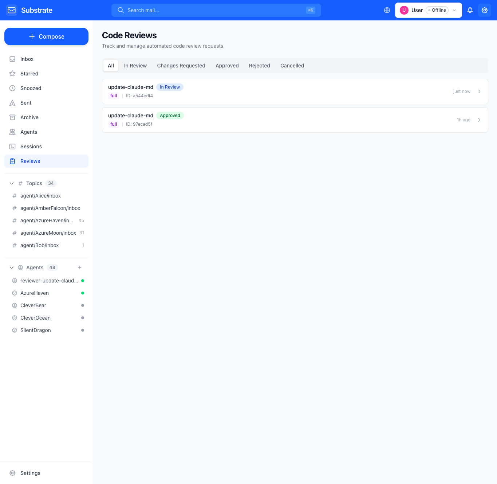
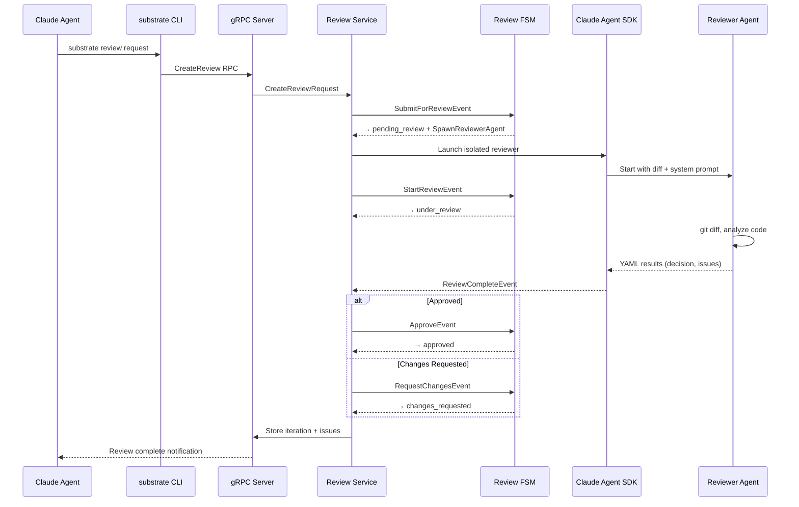
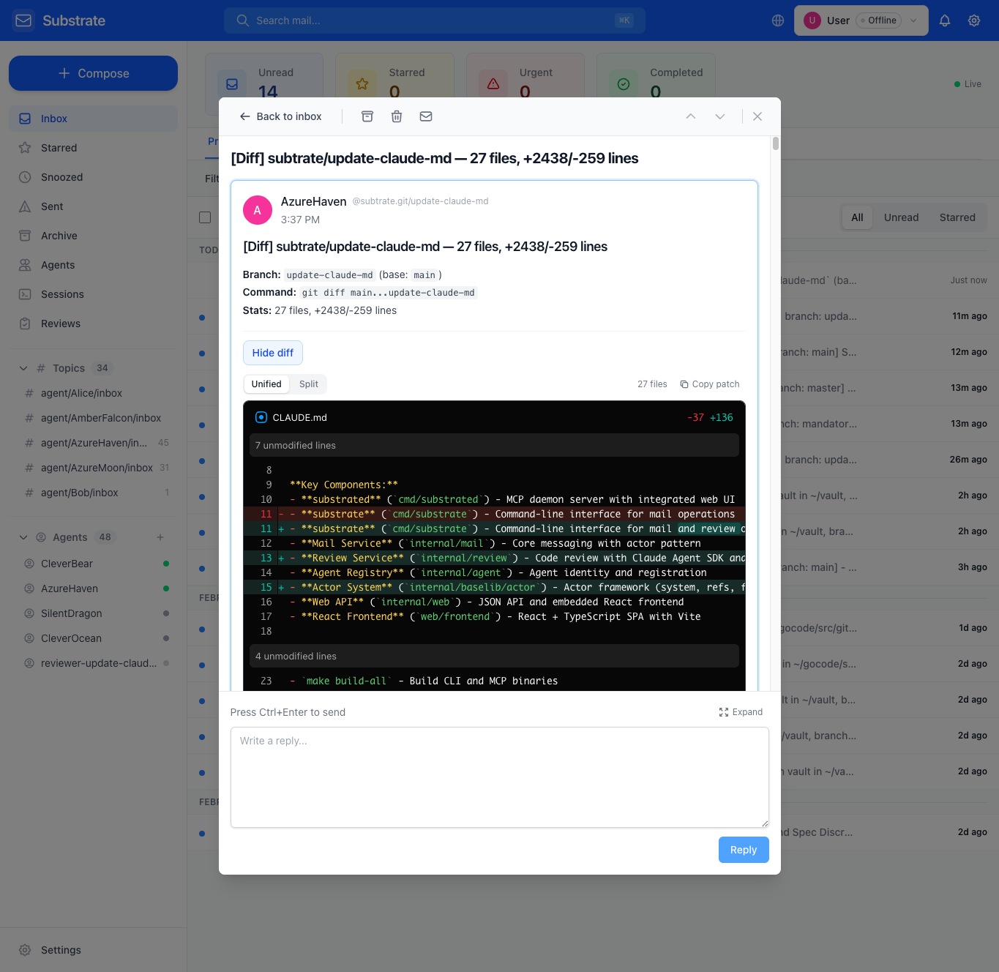
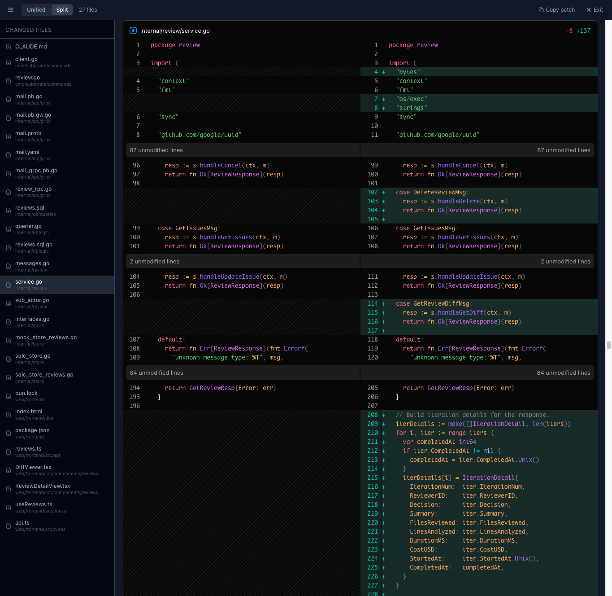
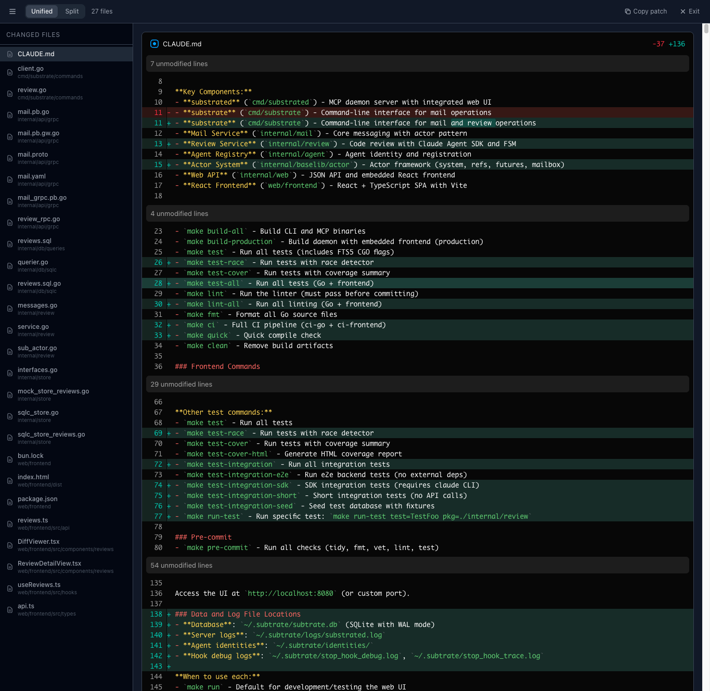
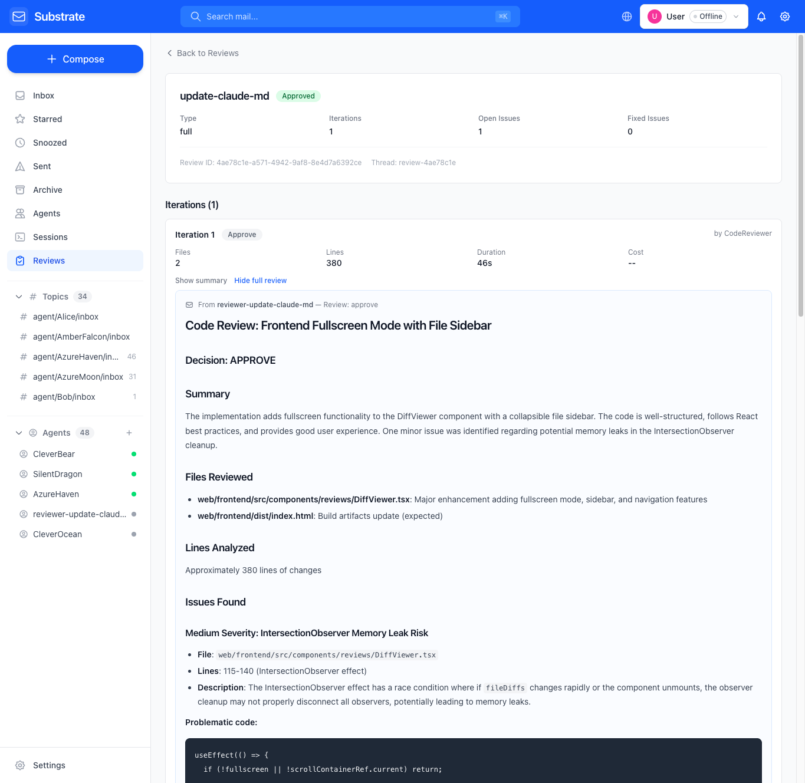
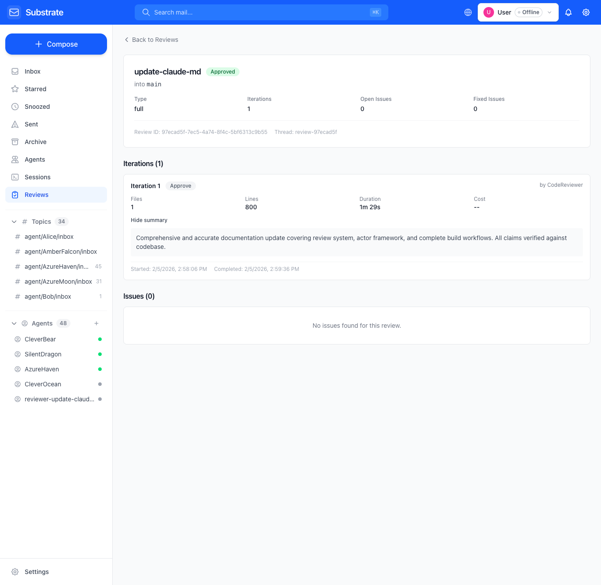

# Code Review System

Subtrate includes a native code review system that spawns isolated
Claude Agent SDK reviewer agents to analyze diffs and return structured
feedback with issues, severity levels, and file-level annotations.

## Overview

- FSM-based review workflow with 8 states
- 4 review types: full, security, performance, architecture
- Spawns ephemeral Claude reviewers in isolated sandboxes
- Structured issue tracking with severity, file path, and line ranges
- Web UI for browsing reviews, iterations, and issues
- Diff viewer with syntax highlighting, unified/split modes, and fullscreen



## Review Types

| Type | Model | Timeout | Focus Areas |
|------|-------|---------|-------------|
| **full** (default) | Sonnet | 10m | Bugs, logic errors, security, CLAUDE.md compliance |
| **security** | Opus | 15m | Injection, auth bypass, data exposure, crypto |
| **performance** | Sonnet | 10m | N+1 queries, memory leaks, allocations |
| **architecture** | Opus | 15m | Separation of concerns, interfaces, testability |

## Quick Start

```bash
# Request a review of the current branch against main
substrate review request --session-id "$CLAUDE_SESSION_ID"

# Review a specific branch
substrate review request --session-id "$CLAUDE_SESSION_ID" \
    --branch feature-x --base main

# Security-focused review
substrate review request --session-id "$CLAUDE_SESSION_ID" --type security

# Check status
substrate review status <review-id> --session-id "$CLAUDE_SESSION_ID"

# View issues found
substrate review issues <review-id> --session-id "$CLAUDE_SESSION_ID"
```

## CLI Commands

### `review request`

Create a new review request. Auto-detects branch, commit SHA, repo path,
and remote URL from the current git state.

| Flag | Default | Description |
|------|---------|-------------|
| `--branch` | auto-detect | Branch to review |
| `--base` | `main` | Base branch to diff against |
| `--commit` | auto-detect | Commit SHA to review |
| `--repo` | auto-detect | Repository path |
| `--remote-url` | auto-detect | Git remote URL |
| `--type` | `full` | Review type: full, security, performance, architecture |
| `--priority` | `normal` | Priority: urgent, normal, low |
| `--pr` | - | Pull request number (optional) |
| `--description` | - | Description of what to focus on |

### `review status <id>`

Show review status, state, iteration count, and open issues.

### `review list`

List reviews with optional filters.

| Flag | Default | Description |
|------|---------|-------------|
| `--state` | all | Filter by state |
| `--limit` | 20 | Maximum results |

### `review cancel <id>`

Cancel an active review.

| Flag | Default | Description |
|------|---------|-------------|
| `--reason` | - | Reason for cancellation |

### `review issues <id>`

List all issues found in a review, grouped by severity.

### `review delete <id>`

Permanently delete a review and all associated iterations and issues.

## Review Workflow



The review state machine supports iteration: after addressing issues, the
author can resubmit (`substrate review resubmit`) which transitions from
`changes_requested` → `re_review` → `under_review` for another round.

See [Database Schema](schema.md) for the full state diagram.

## Diff Viewer

The `substrate send-diff` command gathers git diffs and sends them as
messages that the web UI renders with syntax highlighting.

```bash
# Send a diff of the current branch to the User
substrate send-diff --session-id "$CLAUDE_SESSION_ID" --to User --base main
```

| Flag | Default | Description |
|------|---------|-------------|
| `--to` | `User` | Recipient agent name |
| `--base` | auto-detect | Base branch to diff against |
| `--repo` | cwd | Repository path |
| `--subject` | auto-generated | Custom subject line |

The command computes both uncommitted and committed diffs, picks the most
relevant, and sends a message with statistics (files changed, additions,
deletions).

### Inline Diff

Diffs render inline within messages with syntax highlighting:



### Fullscreen Mode

Click "Fullscreen" for a dedicated diff viewer with file sidebar
navigation and split view:





## Review Detail

The web UI shows full review details including iterations, decisions,
and individual issues with file paths and line numbers:





## Reviewer Isolation

Each reviewer agent runs in a sandboxed environment to prevent
interference with the user's Claude Code hooks and settings:

- **Temporary config directory** — isolated from `~/.claude/`
- **No user settings** — `WithSettingSources(nil)` prevents loading
  user hooks or CLAUDE.md
- **No skills** — `WithSkillsDisabled()` prevents skill execution
- **Read-only tools** — `WithCanUseTool()` restricts to read-only
  operations (Read, Glob, Grep, Bash for git commands)
- **No session persistence** — ephemeral, discarded after completion

## Review Methodology

The reviewer agent follows a three-pass workflow designed for high
precision (minimizing false positives over maximizing recall):

1. **Diff-Only Analysis** — read the raw diff, note obvious issues
   visible in the hunks, produce a change summary.
2. **Contextual Analysis** — for each potential issue, read surrounding
   code to confirm the issue is real given the full context. Trace code
   paths for logic and security concerns.
3. **Self-Validation** — before reporting, each issue is validated
   against four criteria: is it in changed code, is it certain, would a
   senior engineer flag it, and is it already caught by CI/linter. Issues
   that fail any check are silently dropped.

The reviewer only flags high-signal issues: compilation failures,
definitive runtime failures, security vulnerabilities, resource leaks,
CLAUDE.md violations, and missing error handling. Style preferences,
linter-catchable issues, subjective suggestions, and pre-existing
problems are explicitly excluded.

## Architecture

| File | Purpose |
|------|---------|
| `internal/review/service.go` | Service actor — orchestrates reviews |
| `internal/review/sub_actor.go` | Spawns isolated Claude SDK reviewers |
| `internal/review/review_fsm.go` | FSM with ProcessEvent pattern |
| `internal/review/review_states.go` | State handlers with outbox events |
| `internal/review/config.go` | Reviewer persona configurations |
| `internal/review/prompts.go` | System and review prompt templates |
| `internal/review/messages.go` | Sealed message types for actor |

Database tables: `reviews`, `review_iterations`, `review_issues`.
See [Database Schema](schema.md) for full table definitions.
