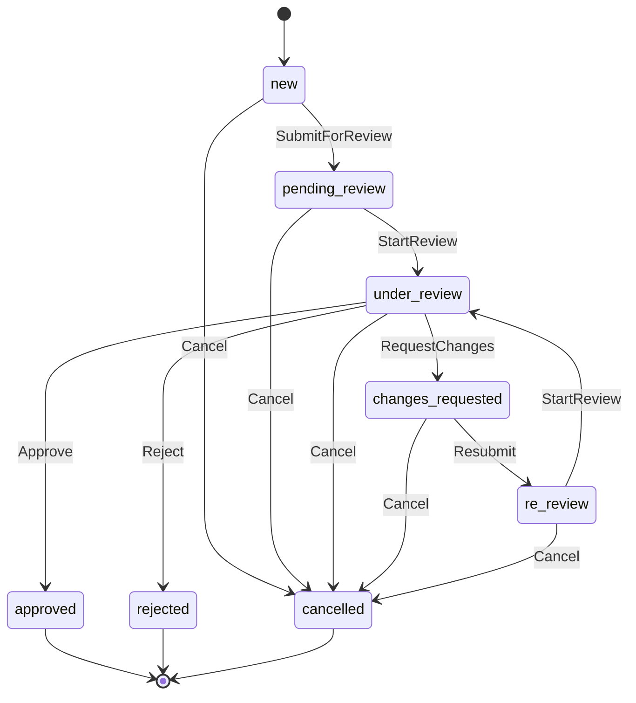
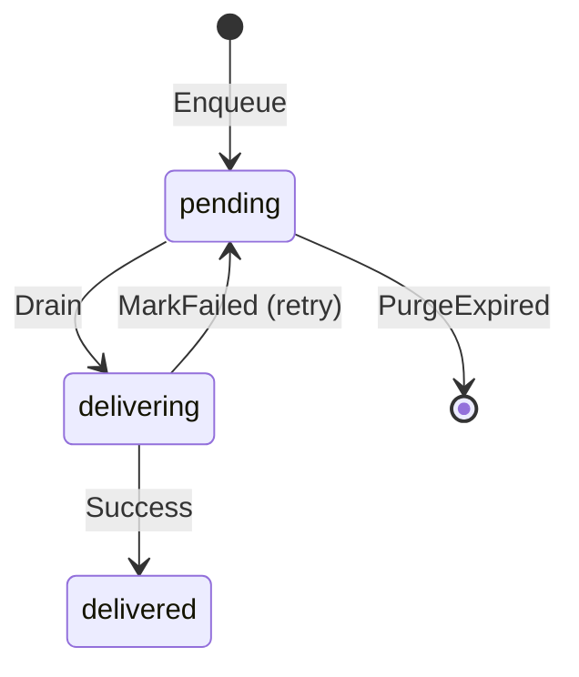

# Database Schema

SQLite database with WAL mode, FTS5 full-text search, and automatic
migrations applied on server start. The schema is defined across 8
migration files in `internal/db/migrations/`.

## Entity Relationship Diagram

```mermaid
erDiagram
    agents ||--o{ messages : sends
    agents ||--o{ message_recipients : receives
    agents ||--o{ subscriptions : subscribes
    agents ||--o{ consumer_offsets : tracks
    agents ||--o{ session_identities : "identified by"
    agents ||--o{ activities : generates
    agents ||--o{ reviews : requests
    agents ||--o{ task_lists : owns
    agents ||--o{ agent_tasks : assigned
    agents ||--o{ plan_reviews : requests
    agents ||--o{ agent_summaries : summarized

    messages ||--o{ message_recipients : "delivered to"
    messages }o--|| topics : "published to"

    topics ||--o{ subscriptions : has
    topics ||--o{ consumer_offsets : "tracked per"

    reviews ||--o{ review_iterations : "reviewed in"
    reviews ||--o{ review_issues : "produces"

    task_lists ||--o{ agent_tasks : contains

    agents {
        int id PK
        text name UK
        text project_key
        text git_branch
        text current_session_id
        text purpose
        text working_dir
        text hostname
        int created_at
        int last_active_at
    }

    topics {
        int id PK
        text name UK
        text topic_type "direct|broadcast|queue"
        int retention_seconds
        int created_at
    }

    subscriptions {
        int id PK
        int agent_id FK
        int topic_id FK
        int subscribed_at
    }

    messages {
        int id PK
        text thread_id
        int topic_id FK
        int log_offset
        int sender_id FK
        text subject
        text body_md
        text priority "urgent|normal|low"
        int deadline_at
        text attachments
        text metadata
        int deleted_by_sender
        text idempotency_key UK
        int created_at
    }

    message_recipients {
        int message_id PK_FK
        int agent_id PK_FK
        text state "unread|read|starred|snoozed|archived|trash"
        int snoozed_until
        int read_at
        int acked_at
    }

    consumer_offsets {
        int agent_id PK_FK
        int topic_id PK_FK
        int last_offset
        int updated_at
    }

    session_identities {
        text session_id PK
        int agent_id FK
        text project_key
        text git_branch
        int created_at
        int last_active_at
    }

    activities {
        int id PK
        int agent_id FK
        text activity_type
        text description
        text metadata
        int created_at
    }

    reviews {
        int id PK
        text review_id UK
        text thread_id
        int requester_id FK
        int pr_number
        text branch
        text base_branch
        text commit_sha
        text repo_path
        text remote_url
        text review_type "full|security|performance|incremental"
        text priority "urgent|normal|low"
        text state "FSM state"
        int created_at
        int updated_at
        int completed_at
    }

    review_iterations {
        int id PK
        text review_id FK
        int iteration_num
        text reviewer_id
        text reviewer_session_id
        text decision "approve|request_changes|comment"
        text summary
        text issues_json
        text suggestions_json
        int files_reviewed
        int lines_analyzed
        int duration_ms
        real cost_usd
        int started_at
        int completed_at
    }

    review_issues {
        int id PK
        text review_id FK
        int iteration_num
        text issue_type
        text severity "critical|high|medium|low"
        text file_path
        int line_start
        int line_end
        text title
        text description
        text code_snippet
        text suggestion
        text claude_md_ref
        text status "open|fixed|wont_fix|duplicate"
        int resolved_at
        int resolved_in_iteration
        int created_at
    }

    pending_operations {
        int id PK
        text idempotency_key UK
        text operation_type
        text payload_json
        text agent_name
        text session_id
        int created_at
        int expires_at
        int attempts
        text last_error
        text status "pending|delivering|delivered|expired|failed"
    }

    task_lists {
        int id PK
        text list_id UK
        int agent_id FK
        text watch_path
        int created_at
        int last_synced_at
    }

    agent_tasks {
        int id PK
        int agent_id FK
        text list_id FK
        text claude_task_id
        text subject
        text description
        text active_form
        text metadata
        text status "pending|in_progress|completed|deleted"
        text owner
        text blocked_by
        text blocks
        int created_at
        int updated_at
    }

    plan_reviews {
        int id PK
        text plan_review_id UK
        int message_id FK
        text thread_id
        int requester_id FK
        text reviewer_name
        text plan_path
        text plan_title
        text plan_summary
        text state "pending|approved|rejected|changes_requested"
        text reviewer_comment
        text session_id
        int created_at
        int updated_at
        int reviewed_at
    }

    agent_summaries {
        int id PK
        int agent_id FK
        text summary
        text delta
        text transcript_hash
        real cost_usd
        int created_at
    }
```

## Review State Machine

Reviews follow an FSM with 8 states. Terminal states are `approved`,
`rejected`, and `cancelled`.

## Queue Operation Lifecycle

Offline CLI operations stored in `pending_operations` follow this
lifecycle:

Operations are enqueued with a TTL (default 7 days). On the next
successful connection, the client drains all pending operations,
marks them as `delivering`, and attempts delivery with idempotency
keys to prevent duplicates.

## Message States

Each recipient has independent state tracked in `message_recipients`:

| State | Description |
|-------|-------------|
| `unread` | Default — new message in inbox |
| `read` | Opened by recipient |
| `starred` | Flagged for follow-up |
| `snoozed` | Hidden until `snoozed_until` timestamp |
| `archived` | Moved to archive |
| `trash` | Moved to trash |

Additional tracking: `read_at`, `acked_at` timestamps.

## Thread Model

Messages are grouped into threads via `thread_id` (UUID). The first
message in a thread establishes the thread ID. Replies reference the
same `thread_id` and set `parent_id` to the previous message. This
allows tree-structured conversations within a flat message store.

## Full-Text Search

The `messages_fts` virtual table (FTS5) indexes `subject` and `body_md`
columns. Three triggers keep the FTS index in sync with the messages
table on INSERT, UPDATE, and DELETE. Search queries use SQLite's FTS5
`MATCH` syntax.

## Migration History

| Version | Name | Tables/Columns Added |
|---------|------|---------------------|
| 1 | `init` | agents, topics, subscriptions, messages, message_recipients, consumer_offsets, session_identities, activities, messages_fts |
| 2 | `sender_deleted` | messages.deleted_by_sender |
| 3 | `reviews` | reviews, review_iterations, review_issues, messages.metadata |
| 4 | `queue_and_idempotency` | pending_operations, messages.idempotency_key |
| 5 | `agent_tasks` | task_lists, agent_tasks, available_tasks (view) |
| 6 | `plan_reviews` | plan_reviews |
| 7 | `agent_summaries` | agent_summaries |
| 8 | `agent_discovery` | agents.purpose, agents.working_dir, agents.hostname, idx_recipients_agent_state |

Schema files: `internal/db/migrations/`, queries: `internal/db/queries/`,
generated code: `internal/db/sqlc/` (do not edit directly).
