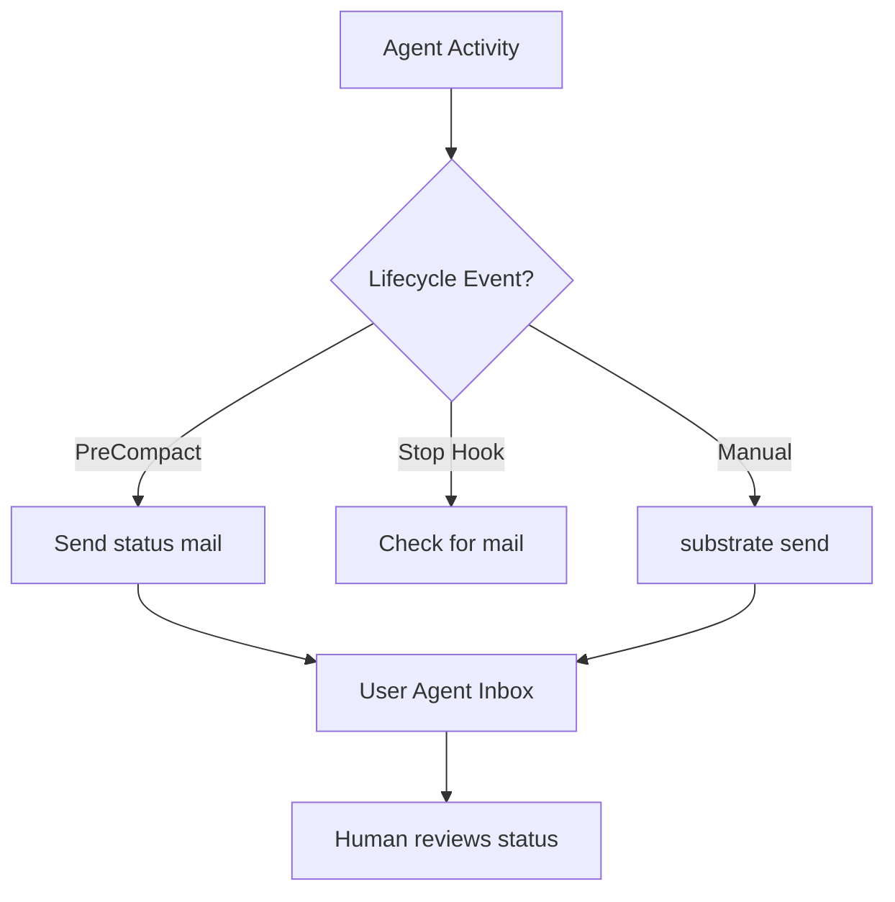
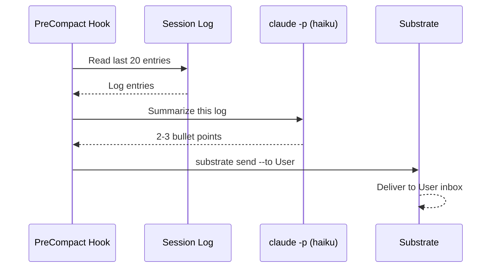

# Agent Status Update System

This document describes how Subtrate agents communicate their status to the central
command (User agent) through automated and manual status updates.

## Overview

Agents send status updates to the "User" agent via mail messages at key lifecycle events.
This keeps the human operator informed about what each agent is doing.

## Status Update Triggers



### Automatic Status Updates

| Event | Hook | What Gets Sent |
|-------|------|----------------|
| **PreCompact** | `pre_compact.sh` | Summary of session progress before compaction |
| **Stop** | `stop.sh` | Status update when agent is standing by (with deduplication) |
| **SessionStart** | `session_start.sh` | Heartbeat + injects pending messages |

### PreCompact Status Mail

When an agent's context is about to be compacted, the PreCompact hook:

1. Saves agent identity
2. Sends heartbeat
3. Generates summary using `claude -p` with haiku model
4. Sends mail to User agent with the summary

**Message format:**
```
Subject: [Status] AgentName - Compacting

[Context: Working on project-name, branch: main]

- Completed X feature
- Fixed Y bug
- Currently working on Z

---
(Automated status before context compaction)
```

### How Summary Generation Works



**Session log location:** `~/.sessions/active/log.jsonl`

**Fallback:** If the log doesn't exist or `claude` CLI isn't available,
a generic message is sent: "Session compacting. Agent will resume shortly."

## Manual Status Updates

Agents can send status updates manually:

```bash
# Send status update
substrate send \
  --to User \
  --subject "[Status] AgentName - Progress Update" \
  --body "Completed feature X, starting feature Y"
```

## Status Message Format Convention

All status messages should follow this format for consistency:

```
[Context: Working on <project> in <directory>, branch: <branch>]
[Current task: <brief description>]

<status details>

---
(Automated/Manual status update)
```

## Hooks and Their Purposes

### SessionStart Hook

**Trigger:** When Claude Code session begins

**Actions:**
1. Export session ID to `CLAUDE_ENV_FILE`
2. Send heartbeat with `--session-start`
3. Check inbox and inject any pending messages as context

**Output:** Plain text for context injection

### UserPromptSubmit Hook

**Trigger:** Each time user submits a prompt

**Actions:**
1. Silent heartbeat (update last_active_at)
2. Check for new mail
3. Inject mail as context if any

**Output:** Plain text (quiet if no messages)

### Stop Hook

**Trigger:** When main agent tries to stop

**Actions:**
1. Quick mail check - block if mail exists
2. Check incomplete tasks - block if any
3. Send status update to User (with 30-minute deduplication)
4. Long poll (55s) - keep agent alive
5. Always blocks to maintain persistent agent pattern

**Status Update (Step 3):**
- Generates summary using `claude -p` with haiku model
- Sends "[Status] AgentName - Standing By" to User
- Uses timestamp-based deduplication (30-minute cooldown)
- Runs in background to not delay the hook

**Output:** JSON `{"decision": "block", "reason": "..."}`

### SubagentStop Hook

**Trigger:** When Task-spawned subagent tries to stop

**Actions:**
1. Check `stop_hook_active` flag
2. If false: quick mail check, block if mail exists
3. If true: allow exit

**Output:** JSON or null

### PreCompact Hook

**Trigger:** Before context compaction

**Actions:**
1. Save identity state
2. Record heartbeat
3. Generate and send status mail to User
4. Output status summary for post-compaction context

**Output:** Plain text for context injection

## Viewing Status Updates

Status updates appear in the User agent's inbox:

```bash
# Check User inbox from command line
substrate inbox --agent User

# Or view in Web UI
open http://localhost:8080/inbox
```

## Deduplication

To prevent message spam, the Stop hook uses timestamp-based deduplication:

**How it works:**
1. Before sending a status update, check flag file `~/.subtrate/status_sent_<session_id>`
2. If file exists and was written < 30 minutes ago, skip sending
3. After successful send, update the flag file with current timestamp

**Flag file location:** `~/.subtrate/status_sent_<session_id>`

**Cooldown period:** 30 minutes (1800 seconds)

This approach is simpler than querying for unacked messages and works offline.

## Debug Logging

The Stop hook writes debug logs to help troubleshoot status update issues:

**Log file:** `~/.subtrate/stop_hook_debug.log`

**What's logged:**
- Session ID and args
- Deduplication check (flag file, elapsed time)
- Agent name lookup result
- Whether status was sent or skipped (and why)

**View logs:**
```bash
tail -f ~/.subtrate/stop_hook_debug.log
```

## Configuration

Status update behavior is controlled by the hook scripts in:
- `~/.claude/hooks/substrate/pre_compact.sh` (installed)
- `internal/hooks/scripts/pre_compact.sh` (source)

To update hooks after changes:
```bash
make build-all && make install
substrate hooks install
```
